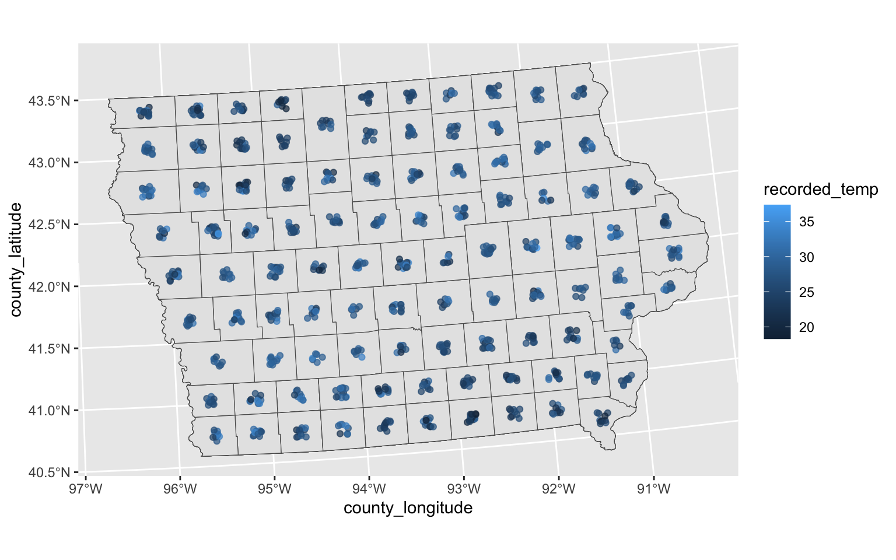
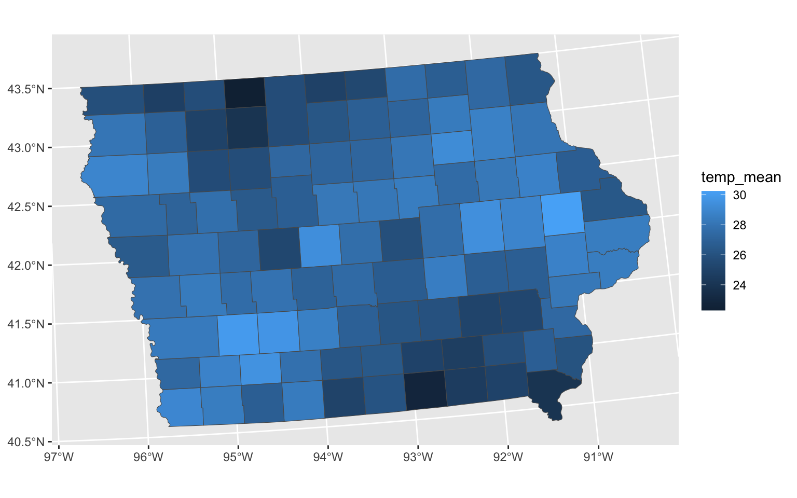
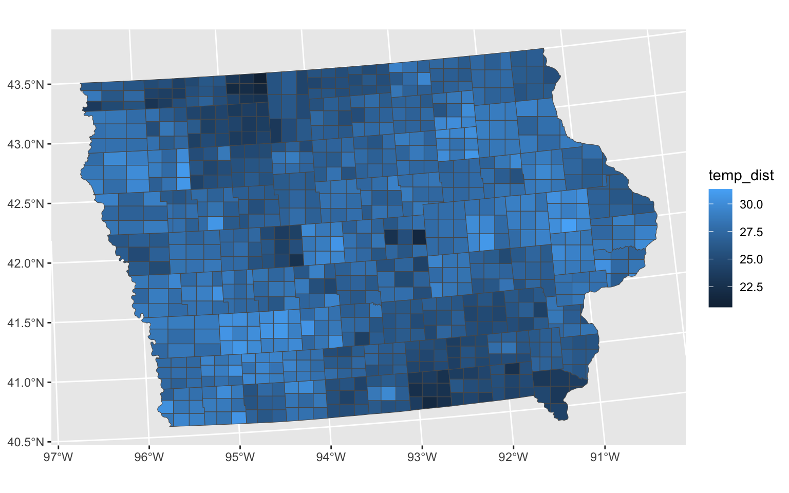
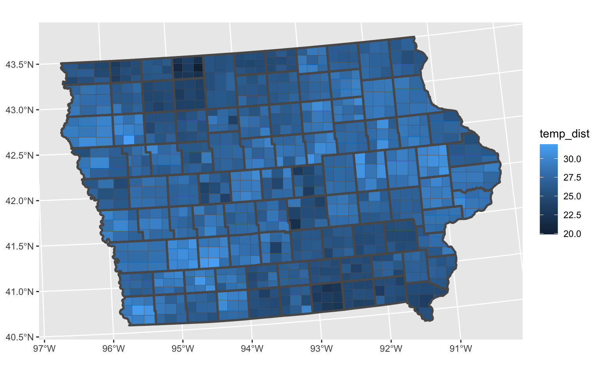

# Software for Simple Uncertainty Visualisation {#sec-second-paper}

## Introduction
- Reiterate some points from previous chapter
- More focus on grammar of graphics

## Background
### Existing software for visualising uncertainty
- While there are other uncertainty visualisation packages currently available (e.g. `ggdist`) their express purpose is to visualise distributions rather than perform signal suppression. 
- Also uses the `distributional` pacakge to represent an estimate as a distribution rather than a single variable, which allows you to create a distribution table (dibble). If a user has a dibble and wants to visualize a distribution and use interesting custom geoms that don't exist in `ggplot2`, then existing packages such as `ggdist` are sufficient.
- ggdist is the most obvious implementation of uncertainty in the grammar of graphics
  - takes the same approach as ggdibbler (i.e. takes a distribution as an input)

### Uncertainties place in the grammar of graphics
- Not immediately clear where uncertainty should fit in the grammar of graphics

*The Grammar of Graphics* is the fundamental building blocks of the information in a graphic, and it allows a plot to be considered a statistic [@Vanderplas2020]. The process for summarising the information in a plot using *The Grammar of Graphics* is depicted in _____(drawing) [@Leland2005]. Unfortunately, *The Grammar of Graphics* is not perfectly suited to summarise the information in an uncertainty visualisation since it assumes that we start from a finite data set. Very often uncertainty is expressed using a distribution or a resampling method that does not have an upper limit on the "sample size". Additionally many uncertainty visualisation experiments notice an interaction between sample size and graphic effectiveness [@Kale2018; @Newburger2022; @Hofmann2012], an effect that is likely caused by a difference in human perception of mass versus sample. 

Additionally, *The Grammar of Graphics* behaves strangely when the sample size is adjusted and it the distance between two graphics becomes less consistent. _____(drawing) shows how three graphics defined by *The Grammar of Graphics* can change as n approaches infinity. The two graphics that are very similar according to the *The Grammar of Graphics* diverge into different graphics, and two graphics that are very different, converge into the same graphic. This means the statistics visualised in the plot as well as the *The Grammar of Graphics* may not be an adequate to summarise the information in a plot that is being used for uncertainty visualisation. Some authors have noticed difficulties with visualising distributions using `ggplot2` and created extensions that make showing distributions more intuitive [@Pu2020; @Kay2023], however these extensions do not address the core discrepancies with uncertainty visualisation and *The Grammar of Graphics*. This does not mean *The Grammar of Graphics* should be abandoned when we attempt to summaise the information in an uncertainty visualisation, very often visations use the same sample to generate all their plots, so this issue is not always present, however these limitations should be kept in mind when analysing uncertainty visualisations using *The Grammar of Graphics*.


## Signal supression in The Grammar of Graphics

### Inclusion of distributions in the framework
- The grammar of graphics assumes we always start with data
- Including uncertainty fundamentally requires us to start from an assumption rather than data, which is less concrete and harder to map in space (less intuitive)

## Practical feasibility of including uncertainty
- Representations of uncertainty: distributions, samples, two variables

## ggdibbler software
Currently `ggplot2` syntax is unable to handle random variables as inputs. If a user wants to make a plot with a random variable, it must first be converted into a determinsitic value. This is a problem as it does not highlight the uncertain nature of the variable in the graphic. Currently, the process of converting any existing plot into one that performs signal suppression (either through a transformation of variables or by visualising a sample instead of an estimate) is tedious.

### Displaying a distribution as a sample
- Sample method in ggdibbler
- For something to be visible on a plot, it must have area, and anything with area can be subdivided, so technically this approach can always be done
- Subdivides the geometric object that was going to be shown

### Warping the space/coordinates
- Discuss how different aesthetics can be warped within the grammar of graphics

#### Colour
- Bivar & VSUP

#### Position
- I suspect this would be janky?

### Secondary Aesthetics
- The axis of a plot are not independent. Aesthetics that may be considered to be independent can be influenced by other graphical aesthetics
- e.g. Area/Length or Transparency


## Application
Currently, the primary useage of ggdibbler is to provide several variations on `geom_sf`. There are other use cases for `ggdibbler` as we will see below, but as of right now, the variation on other geoms are not as fleshed out.


### Spatial Sample example


::: {.cell}

:::


Let us look at one of the example data sets that comes with `ggdibbler`,`toy_temp`.  This data set is a simulated data set that represents observations collected from citizen scientists in several counties in Iowa. Each county has several measurements made by individual scientists at the same time on the same day, but their exact location is not provided to preserve anonymity. Different counties can have different numbers of citizen scientists and the temperature measurements can have a significant amount of variance due to the recordings being made by different people in slightly different locations within the county. Each recorded temperature comes with the county the citizen scientist belongs to, the temperature recording the made, and the scientist's ID number. There are also variables to define spatial elements of the county, such as it's geometry, and the county centroid's longitude and latitude.


::: {.cell}
::: {.cell-output .cell-output-stdout}

```
Rows: 990
Columns: 6
$ county_name      <chr> "Lyon County", "Dubuque County", "Crawford County", "…
$ county_geometry  <MULTIPOLYGON [m]> MULTIPOLYGON (((274155.2 -1..., MULTIPOL…
$ county_longitude <dbl> 306173.3, 746092.2, 381255.2, 696287.1, 729905.9, 306…
$ county_latitude  <dbl> -172880.7, -239861.5, -318675.9, -153979.0, -280551.9…
$ recorded_temp    <dbl> 21.08486, 28.94271, 26.39905, 27.10343, 34.20208, 20.…
$ scientistID      <chr> "#74991", "#22780", "#55325", "#46379", "#84259", "#9…
```


:::
:::


While it is slightly difficult, we can view the individual observations by plotting them to the centroid longitude and latitude (with a little jitter) and drawing the counties in the background for referece.


::: {.cell}
::: {.cell-output-display}
{width=768}
:::
:::


Typically, we would not visualise the data this way. A much more common approach would be to take the average of each county and display that in a choropleth map, displayed below.


::: {.cell}
::: {.cell-output-display}
{width=768}
:::
:::


This plot is fine, but it does loose a key piece of information, specifically the understanding that this mean is an estimate. That means that this estimate has a sampling distribuiton that is invisible to us when we make this visualisation. 


We can see that there is a wave like pattern in the data, but sometimes spatial patterns are a result of significant differences in population, and may disappear if we were to include the variance of the estimates, we can calculate that with the average.


::: {.cell}

:::


Getting an estimate along with its variance is also a common format governments supply data. Just like in our citizen scientist case, this if often done to preserve anonymity. 


The problem with this format of data, is that there is no way for us to include the variance information in the visualisation. We can only visualise the estimate and its variance separately. 


This is where ggdibbler comes in. `ggdibbler` is a ggplot extension that allows us to visulise distributions where we could previously only visualise single values. Instead of trying to use the estimate and its variance as different values, we combine them as a single distribution variable thanks to the `distributional` package and then can use it with the `ggdibbler` version of `geom_sf`, `geom_sf_sample`.


::: {.cell}
::: {.cell-output-display}
{width=768}
:::
:::


To maintain flexibility, the `geom_sf_sample` does not highlight the original boundary lines, but that can be easily added just by adding another layer.


::: {.cell}
::: {.cell-output-display}
{width=768}
:::
:::


### Scatter plot example

### Distribution example


#
- Maybe include an AEMO case study
- Atlas of Living Australia guys also had a good example with rounded locations

## Future Work
- Different types of plots (e.g. scatter plot)
- Different data types for the uncertainty. Currently only have uncertainty in estimates, but could have uncertainty in location in a map for example.
- Alternative variations, e.g. bivariate map.
  - Could implement these methods across different plot types. e.g. what does the space transformation in the bivariate map look like when the x and y component are both spatial instead of coloured.
- Entirely new approaches
- Want to add dibble object so that it is automatic.
- Should include density objects as a "stat_identity" option for the sake of completeness.
