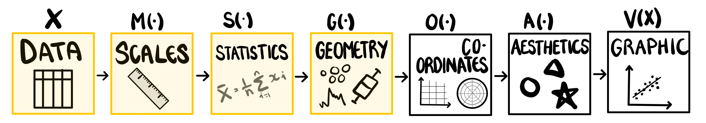

# A Mathematical Framework and Software Implementation for Uncertainty Visualisation {#sec-second-paper}

::: {.cell}

:::

## Introduction

> "Elegant design requires us to think about a theory of graphics, not charts." @Leland2005

Uncertainty visualisation has suffered from a serious lack of formalisation in recent years, which has resulted in an overwhelming tsunami of named plots, touching every corner of the literature.
No visualisation problem is too niche as we see visualisations of 2D-intervals called a cross plot, rectangle plot, segment plot, and dandelion plot [@Zhang2022]. 
No plot change is too small with simulated outcomes on lines called spaghetti plots (or lasagne plots for gradients) [@Swihart2010], on maps called pixel maps [@Vizumap], on bar charts called fuzzygrams [@Kay2023], and when the outcomes are animated, we call them hypothetical outcome plots (HOPs) [@Hullman2015].
No dead horse is too beaten with probability functions having more names than ways to differentiate them with terms like histogram, density plot, violin plot, ridgeline plot, rain plot, dot plot, and gradient plot, only scratching the surface [@Kay2023].
The practice of naming plots turns the field into a race, where authors are incentivised to brand their name on as many graphics as possible, rather than work towards a cohesive theory of visualisation.
This problem is as pervasive as it is frustrating.

According to @Leland2005 "the computer woefully focuses the mind", so we might assume that these hyper-specific naming conventions do not extend to the landscape of uncertainty visualisation software. 
This assumption would be wrong. 
Even just within the R ecosystem of `ggplot2` extensions, there is an overwhelming number of choices, leaving users unclear when each package should be used and for what purposes.
A density plot can be made using `ggplot2`, `ggbeeswarm`, `ggridges`, `ggrain`, `ggdist`, `ggpointdensity`, and `ggdensity`, all packages with similar descriptions and overlapping designs.
This is not to say these packages are pointless: they have thousands of downloads per week and were motivated by a gap in the literature.
Rather, this example illustrates the havoc that named plots contribute to our software ecosystem. 

With this wealth of choices in plots and software, it would be reasonable to assume that the field is meeting the needs of its users, albeit in a messy roundabout way, but this assumption would be incorrect. 
Despite this wealth of choice, each package is brittle and constrained by it's own set of assumptions.
There is a cry for flexibility among the users of uncertainty visualisation software, dating back more than 30 years [@MacEachren1992].
A useful uncertainty visualisation system should allow for exploration with uncertain data from multiple different sources, dimensions, and data types [@Hadjimichael2024; @geointerviews; @MacEachren2005], a flexibility that all current implementations fail to provide. 

This implies the real gap in uncertainty visualisation is not new plots or bespoke software, but structure, and the flexibility that comes with it. 
Structure is not so alien to the visualisation community that this is an unreasonable request.
Standard statistical graphics have been formalised within **the grammar of graphics** [@Leland2005; @ggplot2] for several decades.
This structure has largely been ignored by the uncertainty visualisation community, with the exception of @Kay2023 and the `ggdist` R package.
Along with this formalisation of visualisations of univariate probability functions, Kay expressed hope for a single coherent uncertainty visualisation framework.
This single unified framework, and its implementation in the `ggdibbler` package is what will be discussed in the rest of this paper. 

## Making a density plot
We are going to design our uncertainty visualisation based on a simple assumption based on the existing literature: the input for an uncertainty visualisation is a data set where every cell is a random variable [@Kay2023] which contains all the quantified uncertainty we wish to represents [@Mason2024].
Once we have our distribution inputs, there is only one question left for our uncertainty visualisation system to solve.
What exactly should it *do* with these distributions?

Consider the case of a vector, $X$, that contains the heights of 15 different women, where each $x_i \in \mathbb{R}$ represents one measured height.
If we feed this vector into a density plot function, such as `geom_density()` from `ggplot2`, how should it behave? 
Hopefully, this case is obvious, and the output of this function is shown in the `ggplot2` example in @fig-dist-example.
A density curve of our data is estimated and displayed using a line geometry. 
This is a straightforward example, but what happens when our input is a distribution? 
This can occur if, for example, the tool used to record the heights has an inherent measurement error.
Now, we have a vector, $\textbf{X}$, of 15 distributions, where each $\textbf{x}_i \sim N(x_i, \sigma_i)$, where $x_i \in X$ is the recorded value, and $\sigma_i$ is an estimated variance based on the environmental conditions of the measurement. 
There are two routes we can take when it comes to visualising this estimate. 
The second plot in @fig-dist-example is made using `ggdist`, and it shows the case where we are interested in the distribution of each individual measurement. 
The third plot is made using `ggdibbler`, <!--and it shows the distribution of the entire population,--> which places the emphasis on the full data density *but* carries forward the variability in the density that comes with having distributional inputs.

::: {.cell}
::: {.cell-output-display}
![Alternative interpretations of how to render a density plot when the input is a set of distributions describing uncertainty of measurements, according to three plotting packages: (a) ggplot2 forms the density from the mean values, (b) ggdist puts the distribution on each observation, treating uncertainty as signal, (c) ggdibbler shows the densities for multiple samples, which puts the focus on how the density might look given the uncertainty. These differences illustrate how uncertainty is interpreted in different ways. Which is correct?](03-chap3_files/figure-pdf/fig-dist-example-1.pdf){#fig-dist-example width=100%}
:::
:::

The distinction between the two approaches presented in @fig-dist-example is the same signal and noise paradigm presented by @Mason2024. 
In the `ggdist` plot we are interested in the shape of the distribution of each observation, so we are visualising the uncertainty as a signal.
In the `ggdibbler` plot we are not interested in the uncertainty in and of itself, but rather, we only included it to see how it would change the conclusions from the  `ggplot2` plot, thus, visualising it as noise. 
Given these two approaches, which plot is the "correct" visualisation depends on the goals of our analysis and what we are looking to infer from making the plot.

However, if we want to design a visualisation system for EDA, the method must always work, which means any *existing* plot should always have an "uncertain" counterpart. 
Therefore, we are actually interested in a slightly different question: "Which plot is the correct behaviour of `geom_density` with the distributional input, $\textbf{X}$?".
The answer to this question is definitively, the `ggdibbler` plot. 
The reasoning is rooted in strong statistical foundations; we just need to expand the concepts to visual statistics.

## Visual Statistics
### The deterministic visual function
When you really think about it, what is a visualisation?
One of the most definitive answers to this question can be found in the grammar of graphics, which is a theoretical framework that characterises a visualisation as a series of composite functions [@Leland2005]. 
Under this formalisation, a visualisation is a function that take a deterministic matrix (@def-deterministic) as input and outputs a statistical graphic. 
This formalisation is lengthy, so we summarise the key aspects of it in  @def-vfunc, and @fig-gog, which shows each step of the visualisation process with highlighted sections indicating the sections we will need to adjust for uncertainty visualisation. 
By leveraging the graphics pipeline we make the implicit explicit, which will allow us to compare different uncertainty visualisation systems on a deeper and more objective level [@Wickham2009].
Note that these steps summarise the underlying architecture of the `ggplot2` [@ggplot2] implementation of the grammar which is an essential foundation for this new software. 
However, the conceptual framework described here is not dependent on any particular implementation of the grammar, and could easily be implemented in another grammar of graphics system, such as Vega-Lite [@Satyanarayan2016].
The notation used for visual statistics builds on that developed in @Majumder2013 where the term was first introduced in the context of conducting statistical inference.

::: {#def-deterministic}
## Deterministic matrix
Let $\textbf{A}$ be an $m \times n$ matrix on the sample space $\Omega$. A is a deterministic matrix if $a_{i,j} \forall i,j$ are single-value (non-random) entries.
:::

::: {#def-vfunc}

## The deterministic visual function
Let $X_{n_1,m_1}$ be a matrix of outcomes with $n_1$ rows and $m_1$ columns on the sample space $\Omega$. Let $V$ be a function that maps $X$ from our sample space $\Omega$ to the space of all visual statistics, $\Psi$. We refer to $V$ as a visual function, and its output $V(.)$ as a visual statistic. The visual function, $V$, can be decomposed into the following composite function: 

$$
V = A \circ O \circ G \circ S \circ M
$$ 
where:
  
- $M = [M_1, M_2, ..., M_{m_1}]'$ is a set of $m_1$ functions that each scale one column of our $X_{n_1,m_1}$ matrix. This function maps the individual cells of $X_{n_1,m_1}$, $x_{i,j}$ $\forall i = 1,...,n_1$ and $j = 1,...,m_1$ from the sample space, $\Omega$, to the space of real numbers, $R$.
- $S$ is a statistic function that summarises our $X_{n_1,m_1}$ matrix down to an $X_{n_2,m_2}$ matrix. There is no strict requirements on the statistic function. The function is a transformation from $R$ to $R$.
- $G$ converts two (for a 2D graph) position columns $X_{[.,k]},X_{[.,l]}$ to values that represent magnitudes in space returning an $X_{n_2,m_2}$ matrix on the bounded plane $B^2$. We can further decompose $G$ into $G = E\circ P$, where $E$ is the geometry function that $x_{i,j} \forall j=k,l$ from $R$ to the bounded plane $B^2$, and $P$ is a position modifier function that checks for overlapping values in $X_{n_2,m_2}$ and either stacks them on top of each other in the dependent axis, or dodges them next to each other on the independent axis.
- $O$ is a transformation of our coordinate system. The function is a transformation from $B^2$ to $B^2$.
- $A$ is an injective function that transforms our $X_{n_2,m_2}$ matrix into physically observable stimuli. The function maps our data from $B$, to the space of visual statistics $\Psi$.

:::

{#fig-gog}

### Random matrices and continuous mapping theorem
Unlike a standard visualisation, an uncertainty visualisation has a random matrix (@def-random) input, where distributions replace the single single values of our deterministic matrix (@def-deterministic).

::: {#def-random}
## Random matrix
Let $\textbf{A}$ be an $m \times n$ matrix valued random variable on the probability space $(\Omega, \mathcal{F}, Pr)$. This is a matrix where some or all of it's entries are random variables drawn from some probability distribution.
:::

Combined, @def-random and @def-vfunc boil uncertainty visualisation down to a simple problem.
Our visualisation system needs to be designed in such a way that it follows existing mathematical principles of random variables and functions.
More specifically, our graphics should uphold the *continuous mapping theorem* @thm-cmt [@mann_wald]. 

::: {#thm-cmt}

## Continuous mapping theorem
Let $\textbf{X}$ and $\textbf{Y}$ be $n \times m$ random matrices, and let $Z$ be an $n \times m$ deterministic matrix. Let $f: E\xrightarrow{} E'$ be a continuous function from one metric space, $E$, to another $E'$. Then:
$$\textbf{X} \xrightarrow{} \textbf{Y} \Rightarrow f(\textbf{X}) \xrightarrow{} f(\textbf{Y})$$

and

$$\textbf{X} \xrightarrow{} Z \Rightarrow f(\textbf{X}) \xrightarrow{} f(Z)$$
:::

In simple terms, @def-vfunc and @thm-cmt means that our uncertainty visualisations should have similar convergence properties to their underlying distributions.
For example, if we visualise a $N(0,1)$ distribution as a sample, and a sample from a $N(0,1)$ distribution, as the size of both samples approach $\infty$, the two visualisations should look identical. 

If we accept the definition of idea that a visualisation is a continuous function, adhering to @thm-cmt is not a nice property or an opinion on how visualisations should behave, but rather a *fundamental requirement* of any visualisation of a random matrix.
Or, at least it will be after we establish that the assumptions of @thm-cmt are true.
Which will require us to show that $\Omega$ and $\Psi$ are metric spaces, and then use those metric spaces to define convergence for visual functions.

#### Visual metric spaces
The idea that both $\Omega$ and $\Psi$ are metric spaces is not particularly strange: one of the core tenets of statistical graphics is that they maintain the link between data and visual aesthetic [@Leland2005].
This point was made rather comically by @Bartonicek2025, who drew two rectangles stacked on top of each other, and pointed out that it was not a stacked bar chart. 
The idea that there is some kind of structure, or ordering that we need to maintain implies that $\Omega$ is a metric space.
In most cases, $\Omega \subseteq \mathbb{R}^p$ and it immediately follows that the ordered pair ($\Omega$, $d$) is a metric space, where $d$ is Euclidean distance.
In the cases where $\Omega \not\subseteq \mathbb{R}^p$ the first step of the analysis is to scale the data to using $M$ to $\mathbb{R}^p$, so we can say that ($\Omega$, $d \circ M$) is a metric space.
For our visual space, $\Psi$, we can actually do exactly the same thing, but in reverse.
Since our aesthetic function is defined as $A: B\xrightarrow{} \Psi$, and $B \subseteq \mathbb{R}^p$, we can set out metric to be the inverse of our aesthetic function, such that the ordered pair ($\Psi$, $d \circ A^{-1}$).

Ideally, as visualisations are designed to be viewed by humans, we would have set our distance on $\Psi$ to be the human ability to visually differentiate two plots.
This is similar to the notion of distance that is leveraged by the line-up protocol [@Buja2009].
In the line-up protocol, viewers are shown $M-1$ null plots, $V(X_{N_i})$, where $X_{N_i}$ for $i=1, ..., M-1$ are independent draws generated from some null distribution, and a visual test statistics, $V(X_T)$ where $X_T$ is our actual data. 
If the test statistic, $V(X_T)$, is significant visually different from $V(X_{N_i}) \forall i$ then viewers will be able to pick it out of the line-up, and we would reject our null hypothesis that $X_T$ was generated from the same distribution as $X_{N_i}$.
This test actually measures Mahalanobis distance on $\Psi$, as Mahalanobis distance is a multivariate generalisation of a Z score, and the line-up protocol is the visual equivalent of a hypothesis test. 
Given that human perception is the natural metric for statistical graphics, it is not a metric space.
This is because it violates triangular inequality due to the existence of "just noticeable differences" (JND) [@Luce1958]. 
We can show that human perception is not a metric space with a quick proof.

::: {#prp-metric}
Let $h: \Psi \xrightarrow{} \mathbb{R}$ be a piecewise distance function that measures the human perception of statistical graphics, defined as:
$$
h(x, y) = \begin{cases} 
      g(x,y) & g(x,y) \geq \epsilon \\
      0 &  g(x,y) < \epsilon
   \end{cases}
$$
where $\epsilon$ is the JND of our human observer (with $\epsilon>0$), and $g(x,y) = d(A^{-1}(x), A^{-1}(y))$ is the Euclidean distance in the rendered graphics; $h$ is not a metric.
:::

::: {.proof}

Let $a,b,c \in \Psi$ be three different visualisations, where $a$ and $c$ are plots in the metric space, and $b$ is exactly halfway between them, such that $g(a, c) =  \epsilon$, $g(a,b) = \frac {1}{2} \epsilon$, and $g(b, c) = \frac {1}{2} \epsilon$.
Therefore, $h(a, c) =  \epsilon$, $h(a,b) = 0$, and $h(b, c) = 0$.
If we assume $h$ is a metric space, then the triangular inequality will hold, and we can state
$$h(a, c) \leq h(a,b) + h(b, c)$$
which implies
$$0 \leq \epsilon$$
Therefore, by contradiction $h$ is not a metric.
:::

As long as our graphics system does not let $A$ map to increments $< \epsilon$, this should not be a problem, but due to differences in human perception, $\epsilon$ is not constant for the entire human population, and this system would be impossible to implement. 
This means that we might not be able to visually distinguish every plot that is different in $\Psi$, but if we are able to *see* a difference in two plots, it is definitely there. 

#### Visual convergence
With the metric space out of the way, we need to define the concept of convergence for visual functions.
Thankfully, this is also covered by our definition of a metric space.
Two plots have converged if their renderings are identical.

::: {#def-converge}

## Visual convergence
Let $\textbf{X}$ and $\textbf{Y}$, be $n \times m$ random matrices, and let $Z$ be an $n \times m$ deterministic matrix. Let $V$ be a visual function $V$: $\Omega\xrightarrow{} \Psi$. Let $g$: $\Psi\xrightarrow{} R$ where $g = d \circ A^{-1}$, and $(\Psi, g)$ is a metric space. We say two random graphics have visually converged, that is, $V(\textbf{X}) \xrightarrow{} V(\textbf{Y})$ when $g(V(\textbf{X}), V(\textbf{Y})) = 0$. We say that a random graphic has converged to a deterministic graphic, that is, $V(\textbf{X}) \xrightarrow{} V(X)$ when $g(V(\textbf{X}), V(X)) = 0$.
:::

We will usually approximate this convergence by using visual distinguishably, similar to the approach taken by the line-up protocol.

### Returning to the density plot example
In our density example, we defined $\textbf{X}$ and $X$ such that $\textbf{x}_i \xrightarrow{p} x_i, \forall i = 1,...,15$, then as $var(\textbf{x}_i) \xrightarrow{} 0$, $\textbf{X}\xrightarrow{p}X$ and we should see $V(\textbf{X})\xrightarrow{p}V(X)$. 
That is, as the variance of all the heights in $\textbf{X}$ approaches zero, our uncertainty visualisation should be visually indistinguishable from the `ggplot2` plot of @fig-dist-example.
Looking at the plots, we would observe this behaviour in the `ggdibbler`, but not the `ggdist` plot.
This is why we assert that the `ggdibbler` plot is the random matrix version of the `geom_density` function in the `ggplot2` plot.

## Generalising the visual function
The visual function, as described in the *grammar of graphics*, has one key limitation; it assumes each data point is deterministic.
That is, @def-vfunc in it's current form does not allow for random matrix input.
This is an issue for uncertainty visualisation, as a random matrix input is one of the core assumptions of the approach.
To redefine our visual function such that it accepts random matrix inputs, we will need to adjust the definition of our **scale**, **statistic**, and **geometry** to generalise @def-vfunc.
In doing so, we will also ensure we do not make any changes that will result in a violation to @thm-cmt.
When we finish, we should have a generalised visual function that will accept random matrix inputs for any graphic created using the *grammar of graphics*, with the additional property that the plots always obey @thm-cmt. 

### The adjustment to `scales`
Scales map our data to a set of real number outcomes, they determine how we perceive the size, shape and location of our data, and give our data meaning [@Leland2005].
This sentiment is echoed in the construction of our visual statistics, as the scale, $M$ is used to define the distance metric for our metric space.
To use the same scale, $M$ that was defined for our deterministic matrix $X$ on our random matrix $\textbf{X}$, we will need to perform a "change of variable".
@Kay2023 would refer to this as a "scale aware" requirement for uncertainty visualisation systems.
This means we are not changing the function $M$ itself, but we are just expanding the definition to allow for random matrix input. 
This formalisation of this scale is summarised in  @def-scale, and @fig-scale,

::: {#def-scale}
## Generalised scale
Let $\Omega$ be a sample space and $M$: $\Omega\xrightarrow{} R$ be a scale function that maps our data from $\Omega$ to $R$. 
Let $\textbf{X}$ be a random matrix on the probability space $(\Omega, \mathcal{F}, P)$.
Then the scale function $M$, applied to $\textbf{X}$ will give us $M(\textbf{X})$ with the induced probability measure $P_{M(X)}(A) = P(M^{-1}(A))$. 
:::

{#fig-scale width=80%}

The illustration in @fig-scale shows that our distribution also changes names (i.e. we scale a binary categorical random variable to {0,1} to create a Bernoulli distribution), but this is simply a function of the scaling, and does not represent any meaningful change in the shape of the distributions.

### The adjustment to `statistics`
Statistics provide a summary of our data.
Several graphics, such as box plots, or bar charts are inherently linked to a statistic (the five number summary and summation respectively).
This is the current role of our statistic function, $S$, which is only well defined for deterministic inputs.
Unlike deterministic variables, random variables are more abstract, and cannot be expressed as a single concrete value.
Therefore, there is a second statistic that needs to be computed, which is the statistic that represents the distribution.
The distributional statistic must be calculated at this stage, as the geometry assumes we are working with concrete values that can be mapped to a position in Euclidean space.
Therefore, in uncertainty visualisation, there are two statistics that must be defined: the statistic that represents the distribution, and the statistic that summarises the data.
The generalised statistic function that accepts random variables is shown in @def-stat.

::: {#def-stat}

## Generalised statistic
Let $\textbf{X}_{n_1,m_1}$ be a random matrix on the probability space $(R, \mathcal{F}, P)$.
Let $S_{sample}: (R, \mathcal{F}, P)\xrightarrow{} R$ be a function that transforms the random matrix $\textbf{X}_{n_1,m_1}$ into the deterministic $X_{n_1,m_1, t}$ array, where $t$ is the number of samples drawn from $\textbf{X}_{n_1,m_1}$.
Let $S$: $R\xrightarrow{} R$ is a function that transforms the deterministic matrix, $X_{n_1,m_1, t}$ into a statistical summary, $X_{n_2,m_2, t}$.
Note that $S$ covers all statistics that can be implemented in the deterministic grammar of graphics.
We define $S^*: (R, \mathcal{F}, P)\xrightarrow{} R$ to be the composite function $S = S_{sample} \circ S^*$ that transforms the random matrix $\textbf{X}_{n_1,m_1}$ into the deterministic matrix, $X_{n_2,m_2, t}$.

:::

The definition presented in @def-stat may leave you with some questions, specifically, why we have limited the distribution representation to a sample of outcomes. 
This is the question we will spend the rest of this section answering.

#### Representing a distribution
Distributions are abstract concepts, needing some kind of concrete representation to visualise them. 
This is a common consideration in uncertainty visualisation where we frequently see software that lets us visualise our distribution as a sample of outcomes, a mean and variance, a confidence interval, or even several of these statistics at once [@Potter2010; @Kay2023]. 
Authors often opt for flexibility in the distribution level statistic, with very little consideration as to how this might affect the rest of the plot.
It is not unreasonable to assume that the distribution statistic should be interchangeable, as this is how the *rest* of the grammar operates.
Even @Leland2005 himself expressed this sentiment in the uncertainty visualisation chapter of The Grammar of Graphics.
What this sentiment fails to realise is that the interchangeable nature of the grammar comes from its formalisation, a formalisation that does not properly integrate uncertainty.
When we take the time to formalise uncertainty within the visualisation function, we quickly see that the way we represent our distribution does not have a neutral impact on the other components of the grammar.

#### Beyond point estimates
The first problem is obvious: not all distribution representations can perform signal suppression.
We briefly illustrate the problem here.
@fig-meanprob shows a set of bivariate densities as raster plots visualising the `uncertain_faithfuld` data from `ggdibbler`, which is a random matrix variation of the `faithfuld` data from the `ggplot2` package.
Plot (a) visualises only the estimate, while the other three plots represent the data using a sample. 
As we move from plot (b) to plot (d), the variance in our distribution increases.
This variance is independent of our expected value, so the increasing variance has no impact on the expected value of the distribution - the visualisation of our point estimate does not change as the variance increases and is always represented by plot (a). 

You may still want to visualise summary statistics alongside other representations, such as displaying the variance as a separate density plot. This might seem absurd, and there is a reasonable amount of evidence that visualising summary statistics alongside uncertainty information causes that uncertainty information to be ignored [@uncertchap2022].
The whole point of signal suppression is that it hides a signal that is statistically invalid.

Allowing you to include the point estimates, because the visualisation is too noisy, defeats the entire purpose of the approach.
This property should also ensure the convergence to another distribution, as covered by @thm-cmt.
If we are only concerned about convergence to constant values, we do not need to include uncertainty at all.
Therefore, whichever representation we choose, it needs to convey a complete view of this distribution, a point estimate cannot do that. 
@fig-meanprob shows how `ggdibbler` handles increasing variance in a density plot, as the "graininess" of the plot increases with the uncertainty. 
As the variance increases, these grains dominate the plot, making the visualisation harder to read, as it should be.

::: {.cell}
::: {.cell-output-display}
![How uncertainty is handled (or not) in raster displays of bivariate density.  The axes show the eruption time vs waiting time, and colour indicates density value, with lighter indicating higher density. In plot (a) uncertainty is ignored by showing only the estimate, and plots (b, c, d) show samples reflecting different scales of uncertainty in the density estimate. We can see that as the variance in the estimates increases, the visualisation of the sample becomes harder to read and conveys more uncertainty.](03-chap3_files/figure-pdf/fig-meanprob-1.pdf){#fig-meanprob width=100%}
:::
:::

#### Why not probability functions

Disallowing point estimates doesn't actually limit our flexibility, as we still have samples, quantiles, and probability functions at our disposal.
This is where the "Mr Potato Head" approach to distributional statistics starts to cause problems as we bump up against the orthogonality requirement that is built into the grammar of graphics.
Flexibility requires that *every* deterministic graphic should have an uncertain counterpart, even ones that have a pre-defined statistic comprised of point estimates, such as a box plot or bar chart.
This is a fundamental requirement, otherwise the system will not be an effective EDA tool. 
If we allow for any statistic, we will create a mismatch where the values we are trying to feed into our statistic, $S$ are not on the same domain expected by the function.
To be more explicit, our statistic is expecting values on the domain, $M(\Omega)$.
If we define a new statistic, $S^* = S \circ S_{dist}$, where the range of $S_{dist}$ is not $M(\Omega)$, such as $P_{M(\Omega)}(M(\Omega))$, then we have produced invalid input for the next stage of our visual function, $S$.
For example, if our statistic is expecting heights that range from 150 to 200, we cannot feed in a set of probabilities on [0,1] and expect there to be no issues.
The statistics that create a domain mismatch also tend to create an implicit inference problem, as changing the statistic used to represent the random variables can also change the role of uncertainty in our analysis [@Mason2024].
This means that violating this rule will not only result in unusable inputs or nonsensical outputs for $S$, it will also fundamentally change our visual function, $V$.
This change means our visualisation will not adhere to @thm-cmt, which is the primary requirement of our system.
For these reasons, we can only allow statistical representations that output a range that is equivalent to the input space.

#### Why not quantiles

This leaves quantiles and samples as our remaining distribution statistics. 
It makes sense that these methods would be the most flexible, as a sample is just outcomes on $M(\Omega)$, and quantiles are just ordered samples.
However, the notion of "ordering" which is required for quantile representations produce two problems for a flexible visualisation system. 
The first problem is that quantiles communicate an explicit ordering on $\Omega$.
While the data at this stage is technically on the real line $M(\Omega)$, the quantiles will not have meaning if $\Omega$ is unordered.
When visualising 
Using quantiles to visualise uncertain categorical data will either result in meaningless graphics, or an inability to visualise the data at all.
This limitation would prevent us from visualising uncertain categorical data, which is a common output of classification models. 
The second problem with quantiles is that they don't have a natural extension to multivariate data.
Quantiles are well-defined for univariate cases, but multivariate spaces require several assumptions on the relative magnitude of our variables, which are unlikely to always be correct. 
@fig-circle-line visualises the four scenarios that arise from passing a univariate or multivariate random variable, represented as a quantile or a sample, to the slope or intercept of a `geom_abline`.
This not an unreasonable scenario, as a linear regression with a random intercept and slope a common topic even in introductory statistics courses.
We can see that in the univariate case, where the intercept of the line is am $N(0,1)$ distribution the information conveyed by the quantile (a) and the sample (b) are very similar.
This is because quantiles are well defined in the univariate case.
However, for the multivariate case, adding a second random variable in the slope (such that we are now visualising a multivariate normal distribution with marginal distributions $N(0,1)$, and a covariance of $-0.8$) throws our notion of ordering out the window.
In this case, quantiles are not well defined, as any quantile, $q$, will have an infinite number of (intercept, slope) pairs that could produce that probability, and are better conveyed by a function (hence why contour plots are typically used).
As we cannot visualise the slope of a line as a function, a sensible alternative might be to use the marginal or equicoordinate quantiles [@Bornkamp2018].
We opted to use the marginal quantiles, which is also used to colour the lines in both representations, but the conclusions are the same if we use the equicoordinate approach instead.
This allows us to see the danger of using quantiles as our distribution representation.
The first issue is that the notion of ordering we have imposed on the quantiles does not translate in the multivariate case, which can be seen in the haphazard colouring of the lines in the sample, which was not a problem in the univariate case.
The implicit pairing of values has also changed the point of intersection of the lines, and the neatness of the quantiles conveys more certainty in our conclusions than is warranted by the actual data.
Even if we tried to work around these problems by coming up with some abstract definition of a visual quantile we wouldn't be able to draw the output with a straight line, which is the only real requirement for `geom_abline`.

::: {.cell}
::: {.cell-output-display}
![Why quantiles are problematic for representing our distribution variables, using regression coefficients. Intercepts and slopes were simulated using marginal distributions of N(0,1) and a covariance of -0.8.  Plots (a) and (b) have only the intercept treated as random, and show the quantiles and samples, respectively. Colour maps to quantile in (a) and to the value of the intercept in (b): both plots convey similar information. It breaks down when both slope and intercept are treated as random, shown as quantiles (c) and samples (d). Colour is mapped to the same notion of distance that is used to construct the quantiles. But distance is not well defined, and we can see the approaches diverge in the erratic colouring of the lines. Quantiles are not sufficiently flexible representations of distributions.](03-chap3_files/figure-pdf/fig-circle-line-1.pdf){#fig-circle-line width=100%}
:::
:::

 
#### Distributions as samples

This means that the only representation of a distribution that is equally as flexible as a point prediction is a sample of outcomes.
Of course, we don't want a sample of individual points; we want a sample of geometric objects.
To get this, we need to pass the data through the visual function in batches, where each batch represents an outcome of the full random matrix.
In practice, this translates to "splitting" on the `drawID` in the Grammar of Graphics [@Leland2005], or changing the `group` variable to include the `drawID` in `ggplot2` [@ggplot2]. 
@fig-grouping-need demonstrates the effect of grouping in the implementation. 
Without the grouping, the standard error on `geom_smooth` artificially shrinks to zero, and our estimated standard errors are wrong. 

::: {#fig-grouping-need .cell layout-ncol="2"}
::: {.cell-output-display}
{#fig-grouping-need-1 width=100%}
:::

::: {.cell-output-display}
{#fig-grouping-need-2 width=100%}
:::

An illustration of the effect of grouping on the statistic of the plot. We can see that we need to pass our samples through the visual function in batches to ensure that the statistics are not artificially changed by the sample size. 
:::

  
The requirement for samples and *only* samples as our distribution representation is why the formalisation by @Kay2023, despite having the insight to use distributional inputs, did not have the full flexibility required for EDA. 
By allowing flexible distribution representations, `ggdist` is focused on looking at distribution as values in their own right, rather than integrating uncertainty into existing visualisation systems.
This is also how the visual functions of `ggdist` and `ggdibbler` in @fig-dist-example diverges from one another.
It is important to understand that neither approach is a subset of the other, they are orthogonal, and most of the plots made in `ggdist` cannot be made using `ggdibbler`. 
While there are instances that both `ggdist` and `ggdibbler` produce similar looking plots, these plots cannot be made using the same data or the same code.
The distinction between the two approaches translates directly from the philosophy of @Mason2024, who pointed out that the difference between the role of signal and noise is in our inferential statistics. 
By having the distribution statistic subsume the statistic of the plot, we are changing our inferential statistic and visualising uncertainty as a signal. 
This is why we repeatedly say that `ggdist` is for looking at uncertainty as signal, and `ggdibbler` is for looking at uncertainty as noise.

### The adjustment to `geometry`
The geometry component of the grammar translates our data to a magnitude in space [@Leland2005].
By displaying each distribution as a sample, we have distilled uncertainty visualisation down to a simple over-plotting problem; where we previously had a matrix, $X_{n,m}$, we now have an array, $X_{n,m,t}$.
Therefore, to pass our data through the following stages of the grammar, we need to flatten our array back into a matrix in such a way that we ensure each outcome from our random matrix is equally weighted.
Over-plotting is usually managed by the geometry component of our visual function by using position adjustments such as dodging to prevent overlap or transparency to make the overlapping visible [@Cook2016; @ggplot2; @Leland2005].
Position adjustments are an umbrella term used to describe any small changes to the position of a geometric object, and are usually implemented to ensure different groups are equally visible.
We can replicate this system with a nested position system, that performs our sample position adjustment within any position adjustments already existing in the plot.
This is the final change we will make to our visual function to allow the visualisation of random variables, and it is formalised in @def-geom.

::: {#def-geom}
## Generalised geometry
Let $G^*$: $R\xrightarrow{} B$ be a geometry function that transforms an array of data into a matrix of geometric positions. 
We can further decompose $G^*$ into $G = E\circ P^*$, where $E:R\xrightarrow{} B$ is the geometry function, and $P^*:B\xrightarrow{} B$ is the position adjustment.
Let $C_{n,m,t}$, $B_{n,m,t}$, $A_{n \times t,m}$ be matrices of geometric positions.
We can further decompose $P^*$ into $P^* = P_{within} \circ P_{between}$, where  

- $P_{within}$ is a within sample position adjustment that transforms $C_{n,m,t}$ to $B_{n,m,t}$, by identifying overlapping points on $C_{n,m,i}$ $\forall i = 1,...,t$ and applying the specified sample position function, and.  
- $P_{between}$ is a between sample position adjustment that transforms $B_{n,m,t}$ to $A_{n \times t,m}$ by flattening $B_{n,m,t}$ into $B_{n\times t,m}$, identifying overlapping points on $B_{n\times t,m}$ and applying the specified position adjustment.

:::

We will spend the rest of this section detailing the nested position system.

### Nested position adjustments
Position adjustments adjust the location or size of a geometric object to prevent overlap and ensure all geometric objects remain visible.
They achieve this by placing objects beside one another (dodging), stacking them on top of each other (stacking), placing them in front of each other and making them see through (transparency), or showing them one after each other in quick succession (animations).
These options make up the four dimensions that we have available for position adjustments: x (dodge), y (stack), z (transparency), and time (animation). 
Including transparency and time as position adjustments is not the standard approach in the literature, as these plots are typically considered separate axes.
This is not unique to uncertainty visualisation, even @Leland2005 did not discuss positions relative to the axis of x-y-z-t, but rather specified position adjustments as being on the measured scale (stack) or in the spare space (dodge). 
This is an important distinction, but we choose to frame the positions in terms of x-y-z-t to highlight that there may be multiple measured or spare axis in a single plot.

Unlike the statistics, (most) position adjustments do not meaningfully change the inferential statistic of our plot, so we can nest them freely without concern. 
This is particularly useful because without nested position adjustments, we would need to apply the same position adjustments to the over-plotting caused by both the original grouping and the sampling.
Since we cannot use stacking on the measured axis for our samples, this would prohibit us from making uncertain versions of stacked bar charts, which, again, would be an undesirable limitation to our uncertainty visualisation system.
We can see this problem in @fig-positions, which shows the visualisation of a stacked bar chart of the `mpg` data (a), alongside a visualisation of its random counterpart, the `uncertain_mpg` data, visualised using a "stack" (b), "stack_dodge" (c), and "stack_identity" (d), position adjustment.
The fact that stacking is not a viable approach should be obvious: the scale has been artificially inflated, and the visualisation provides little to no information about our data.
In the case of a bar chart, stacking is aligned with our measurement axis (y), which is that leads it to being a problematic adjustment, as our between sample position adjustment, $P_{between}$, can only be a implemented on an axis representing spare space.
In other words, stacking is only a viable position adjustment when the sum of the stacked groups holds meaning [@Leland2005], which is not true for an arbitrary number of samples.
Interestingly, this split of appropriate versus inappropriate position adjustments is opposite to the findings of @Bartonicek2025, who found that stacking was the only appropriate axis to use for interactivity, for similar arbitrary scale change issues. 
This suggests the possibility of an underlying orthogonal relationship between uncertainty and interactivity in statistical graphics, that would allow us to implement both interactivity and uncertainty visualisation simultaneously.

::: {.cell}
::: {.cell-output-display}
![Four stacked bar charts, each made using a different position adjustment, to show the need for nested position adjustments. Plot (a) shows what a deterministic plot looks like for reference, while plots (b), (c), and (d) use the same visual function, but have a random variable input. We can see that stacking is not viable as plot (b) is unreadable and does not maintain continuity, while dodging (c) and transparency (d) work well. It is clear that we should not use the measurement axis for our samples' position adjustment.](03-chap3_files/figure-pdf/fig-positions-1.pdf){#fig-positions width=80%}
:::
:::

Using this framework, we find that a lot of plots with distinct names can actually be described by a single plot with different position adjustments. 
For example, if we have a map with the fill of each area represented by a random variable, then we could capture this uncertainty using a HOPs [@Hullman2015], a pixel map [@Vizumap], or a value-suppressing uncertainty palette [@Correll2018].
These plots could all be made in `ggdibbler` using a `geom_sf_sample` and an animation, subdivide (a simultaneous dodge and stack), or transparency position adjustment, respectively. 
If we consider a facet to be a "between" plot position adjustment, in contrast to the "within" plot position adjustments we get with dodging and transparency, we can extend this idea further.
Under this framework, the uncertainty visualisations that map a null distribution with an alternative on the same plot [@Guo2024; @Hullman2021; @Savvides2019; @McNutt2020] are just the line-up protocol [@Buja2009] without the "between plot" position adjustment.

The most appropriate position adjustment is not set in stone and can depend on which aesthetic the random variable is mapped to.
Different position adjustments have different impacts on our ability to read a plot. 
@fig-rightposition shows four different plots, two with a random variable mapped to text using a transparency (a) and jitter (b), and two with a random variable mapped to colour using a dodge (c) and a transparency (d). 
We can see that transparency works quite well for text, while position adjustments such as jitter make the overlapping text harder to read, regardless of the uncertainty in the estimate. 
We can see that colour works well with dodged positions, as it allows us to see the full sample and do the final calculation visually.
Managing colour with transparency will still produce a technically correct plot, but it can lead to colours that cannot be matched to the legend as high variance colours mix and create new colours that do not belong to the palette.
Differences in the most appropriate position adjustment can cause conflict when there are multiple sources of uncertainty in a plot. 
It would be interesting to investigate this further with a perceptual experiment to test the effectiveness of different position adjustments for different aesthetics, but that is well beyond the scope of this paper.  

::: {.cell layout-align="center"}
::: {.cell-output-display}
![The impact aesthetic mapping and position adjustment pairings can have on the readability of the plot for text (a, b) and tiles (c, d). The plot shows the effect of using transparency and dodging/jitter on the aesthetics of text and colour. When we are looking to extract shapes or text, transparency with no x/y position adjustment is the ideal visualisation. When we are looking at a colour, we prefer to have an x/y position adjustment and avoid using transparency. It would be interesting to verify the optimum aesthetic-position mappings through a perceptual experiment.](03-chap3_files/figure-pdf/fig-rightposition-1.pdf){#fig-rightposition fig-align='center' width=80%}
:::
:::

### The generalised visual function
If we combine the definitions from @def-vfunc, @def-scale, @def-stat, and @def-geom we have a generalised visual function that accepts random variable inputs.
In this generalised visual function, the deterministic graphics made by @def-vfunc are simply a special case of @def-vgeneral, where every cell is a degenerate distribution. 

::: {#def-vgeneral}

## The generalised visual function

Let $\textbf{X}$ be a random matrix on the probability space $(\Omega, \mathcal{F}, Pr)$. 
Let $V$ be a function that  maps $\textbf{X}$ from $(\Omega, \mathcal{F}, Pr)$ to the space of all visual statistics, $\Psi$. 
The visual function, $V$, can be decomposed into the following composite function: 

$$
V = A \circ O \circ G^* \circ S^* \circ M
$$ 

:::

## Implementation in `ggdibbler`
The visual function given by @def-vgeneral should allow you to make an uncertainty visualisation version of any graphic that can be described with the grammar of graphics.
We have implemented this theory in the R package, `ggdibbler`, which is a `ggplot2` extension that allows users to create an uncertain version of any `ggplot2` graphic.
@fig-illustration illustrates this flexibility by showing a collection of plots that were all made using this generalised visual function. 
We can see that there is flexibility in both plot type, as we display line plots, maps, pie charts, histograms, bubble charts, and network diagrams, and in aesthetic as position, colour, size, slope, and other aesthetics all have a random variable mapped to them.
A single plot can even have multiple sources of uncertainty simultaneously mapped to different aesthetics.
By establishing a set of rules that will almost always work, we save ourselves from having to design bespoke software for every single individual case. 

::: {.cell layout-align="center"}
::: {.cell-output-display}
![An illustration of the extensive flexibility offered by our formalisation of uncertainty visualisation. There is no limitation on visualisation type as we include uncertainty in a line, map, pie chart, histogram, bubble chart, and network diagram. There is also no limitation on aesthetics, as position, colour, size, slope, are all mapped using random variables. The implementation of this formalisation in ggdibbler, means that all these plots can be made with almost identical syntax as we would use for the deterministic ggplot2 equivalent.](03-chap3_files/figure-pdf/fig-illustration-1.pdf){#fig-illustration fig-align='center' width=100%}
:::
:::

While we have established the conceptual theory that would underpin a flexible uncertainty visualisation system, there are considerations that need to be made when implementing the theory as practical software.
Specifically, we should discuss the data objects that allow us to work with random matrices, the design of the user interface, and the computational complexity that comes with uncertain plots. 
This section, will detail these components.

### The software design
The way that a user interacts with a piece of software can help communicate the mechanisms or theory that underpins it.
The statistical theory behind random matricies, visual convergence, and continuous mapping theorem that underpins the `ggdibbler` package might be too complicated for someone trying to make a simple scatter plot, but a basic understanding of these ideas is required to use the package correctly.
Therefore, when designing the functions, we opted to subtly communicate these ideas through coding paradigms and function names. 

Readers familiar with programming paradigms might look at @def-vfunc and @thm-cmt and immediately think of object-oriented programming (OOP). 
These readers would be right, `ggplot2` can be considered to be an object-oriented system with a functional-feeling interface. 
Actually, the bulk of functionality underlying R structures can be considered to be object-oriented. 

In OOP systems, data is stored as objects and methods that operate on these objects. 
The user interacts with these objects only through the methods, not by directly inspecting the elements. 
Objects can inherit, so special objects have features that will work in a variety of settings, and also some additional special features. 
Different objects can respond to the same method call in different ways (polymorphisms). 

Today's R contains several choices in data management, S3, S4, R6 and the latest S7. 
S3 forms the original framework, and an example of the polymorphism is the `print()` function, where what is printed will change depending on the object provided. For example, a `data.frame` will be printed differently from an `lm` (linear model object). 
It lacks the full characteristics of OOP, though, because there are no formal class definitions, and it is easy to misuse. 
S4 is stricter and underlies all of the Bioconductor [@bioconductor], but more cumbersome for the user. 
S7 is designed to have the ease-of-use of S3 but the strict checks of S4. 

The main reason to use OOP is polymorphism, which allows us to apply the same function to different classes of input [@Wickham2019]. 
For example, this paradigm would allow us to create a `draw` function that accepts both `polygons` and `lines`, drawing either one without any special input from the user.
The `sf` package's `geom_sf` function allows users to indiscriminately pass points, lines, and polygons to the function which responds exactly as the user expects, plotting geoms appropriate to the spatial class passed in.
OOP is the logical approach for uncertainty visualisation, as we want to convey that $V$ is the same function regardless of the input type.
From the perspective of the user, the function should be the same whether we input $\textbf{X}$ or $X$.

Not only is OOP theoretically consistent with our goals, but it is also the most practical approach.
Using OOP allows us to hide unnecessary complexity, which is particularly helpful for uncertainty visualisation, as the abstract nature of uncertainty causes it to be quite error-prone.
Visualising uncertainty without the guardrails put up by `ggdibbler` can lead to cases where uncertainty is visualised as a separate variable, and the graphic does not have the statistical properties guaranteed by the package.
This approach will also make it easier to perform EDA, as the most flexible programming systems make no assumptions about our data; instead, they react to the object input by the user to determine the initial mapping [@Leland2005]. 
This principle is already carried through in `ggplot2`, where plots automatically adapt to 
categorical, continuous, discrete, or date-time inputs by having an OOP scale, $M$.
While it would be nice to implement `ggdibbler` as an uncertainty visualisation system requires more intensive changes to $V$.

The implicit relationship between `ggdibbler` and `ggplot2` is communicated through the syntax of the code. 
Ideally, if all of `ggplot2` were built on an OOP system, we could just create an "uncertainty" version of all the `ggplot2` functions, allowing users to pass distributions without even noticing the change in the underlying package. 
That is, both the `ggplot2` and `ggdibbler`plots from @fig-dist-example would use the syntax, `ggplot(data = density_data) + geom_density(aes(x = x))` where the visualisation software runs the `ggdibler` code if `x` is a `distirbutional` object.
As `ggplot2` is not built on an OOP system, this is not possible,  so instead, `ggdibbler` adds a `*_sample` suffix in the function name.
This allows us to maintain similar naming conventions to the related `ggplot2` function, while also being explicit about what the function does.
For example, the code that makes the `ggplot2` density is `ggplot(data = density_data) + geom_density(aes(x = xmean))`,  while the code that makes the  `ggdibbler` density is is `ggplot(data = density_data) + geom_density_sample(aes(x=xdist))`. 
This syntax still conveys the idea that the visual function is identical; it is only the input that has changed.

This strong theoretical foundation doesn't only give us an intuitive function design, but it also allows us to have a lot of versatility built on a shockingly simple code base.
Despite the package covering the full range of geoms in `ggplot2`, the bulk of `ggdibbler` is a single function that does the sample and group adjustment, and a second function that nests the positions (if needed).
Every `geom_*` has a `geom_*_sample` counterpart that calls these core functions, and then passes the data through the standard `geom_*` pipeline, with no little to no bespoke adjustments for individual geoms.
A significant amount of the simplicity of the design comes from the packages dependencies: `distributional` [@distributional], `ggplot2` [@ggplot2], `dplyr` [@dplyr], `rlang` [@rlang], `lifecycle` [@lifecycle], `scales` [@scales], `tidyr` [@tidyr], `tibble` [@tibble], `cli` [@cli], and `sf` [@sfpack].

### Representing uncertainty using `distributional`
The theoretical framework we have presented assumes you already have a random matrix input and thus far, we have somewhat ignored how you would go about making one. 
This is because quantifying uncertainty and representing as a data object is fundamentally part of the data manipulation stage of our analysis, so it should be kept as separate as possible from the visualisation stage [@ggplot2].
This gives users full transparency in *what* precisely they are visualising [@ggplot2].
In `ggdibbler`, this separation is created by leveraging the `distributional` package [@distributional], which allows users to store distributions inside data frames as individual cells. 
`ggdibbler` works from the assumption that users have already quantified the uncertainty as distributions before attempting to visualise it, building a system that allows for `distributional` inputs. 

The `ggdibbler` package is designed to accept any `distributional` input.
There are two ways you can define a distribution in `distribtional`:  

  1. A theoretical distribution defined by the distribution and it's parameters, or
  2. An empirical distribution defined by a set of samples

Most types of uncertainty can be represented as one of the two cases, so the software is surprisingly flexible.
The purpose of the distribution is to accommodate classical statistics, or even Bayesian thinking, where the distribution is known or specified. 
The reason for being able to specify the distribution through samples is to accommodate the common situation today that the distribution may not be known, but we can describe it with samples. 
Such a situation might arise when we have bootstrap samples describing the variability. 

The `ggdibbler` software implements a full uncertain replication of `ggplot2`, including the examples.
This requires `ggdibbler` to have uncertain versions of all the data sets used in the`ggplot2` examples, made in distributional, including (but not limited to) `uncertain_mpg`, `uncertain_faithful`, and `uncertain_economics`.
These examples make use of both the theoretical and empirical distribution types.
This allows users to immediately start using `ggdibbler` with familiar data and plots, making the system less daunting to integrate into an existing data analysis pipeline.

### Additional computational complexity 
Replacing a single plot with a large sample of plots can significantly increase the computational complexity of the visualisation.
The more random variables we feed into the plot, the bigger the sample size needs to be, but the bigger the sample size gets, the more computationally expensive the plots become to make and render.
These are simply manifestations of the classic statistics trade-off between computational cost and accuracy, and the curse of dimensionality. 

In `ggdibbler`, this sample size is controlled by the `times` argument, which is set to `10` by default.
Sometimes this is appropriate, sometimes it is not; it depends on the variance of the distributions, the particular plot type, the number of random variables fed in, etc. 
We cannot set a reliable and sensible `times` argument that works for every plot in every situation, so instead we advise you pick a sample size that allows your plot to converge. 
This is a different type of convergence to the convergence to the deterministic `ggplot2` plot we discussed earlier.
Technically, a `ggdibbler` visualisation is a random variable, so every time you print one, it will draw a new random sample and look slightly different to the previous renderings.
If your sample size is big enough, the variability between each visualisation should be small enough that your conclusions do not change between renderings.
We could take this a little further and suggest that your sample size should be large enough that different renderings are visually indistinguishable from one another.
In other words, they have visually converged by @def-converge.
To be more specific, let $V(\textbf{X})_i$ be the $i^{th}$ rendering of a `ggdibbler` plot, then we would say that the plot has converged (and our sample size is large enough) when $d(V(\textbf{X})_i, V(\textbf{X})_j)=0 \forall i$.
This process of visual convergence is shown in @fig-correct-times. We can see that the full shape of the distribution becomes more visible as the `times` argument increases (the input is a scatter plot of uniform distributions).

::: {.cell}
::: {.cell-output-display}
![A scatter plot of a random matrix version of the mtcars data from the 'datasets' R package, with the aesthetic mapping x=mpg, y=wt and colour=cyl. This plot shows the impact of an appropriately chosen times argument. We can see that as the sample size increases, the distributions form cohesive units and stop looking like a collection of separate points with little connection. This is not always achievable due to computational cost, but we should, at the very least, select a sample size that means our conclusions are not changing between renderings of the plot.](03-chap3_files/figure-pdf/fig-correct-times-1.pdf){#fig-correct-times width=100%}
:::
:::

Given this additional complexity, we might opt to skip the entire sampling procedure and instead just map the "uncertainty" to some kind of aesthetic.
After all, despite only using samples to depict uncertainty, the `ggdibbler` documentation (along with this paper) is littered with plots that appear to be using the explicit mappings that are commonly associated with uncertainty.
Blur, fuzziness, colour lightness, and shape/size frequently appear despite never being controlled through the aesthetics. 
Therefore, it might be more computationally effective to just control these elements directly.

While this ideas is not unreasonable, and might be possible to implement in the future, we do not take this approach in `ggdibbler`, as directly mapping uncertainty seems to be wrought with danger.
The source of the uncertainty and it's visual expression is tightly linked in a `ggdibbler` plot.
Take, for example, the appearance of blurring and fuzziness shows in @fig-fuzzy-blur, which depicts `ggdibbler` fuzziness in a bubble chart, `ggdibbler` blur in a dotplot, and `ggdist` blur in a dotplot.
Both blur and fuzziness use a transparent position adjustment, but blur is created through uncertainty in position, while fuzziness is created through uncertainty in size. 
This allows us to convey multiple types of uncertainty at once, as blur makes it more difficult to read the position but does not affect our ability to read the size, and vice versa for fuzziness. 
The inability to convey multiple types of uncertainty is the most common difficulty faced by uncertainty visualisation approaches [@geointerviews; @Hadjimichael2024; @MacEachren2005]. 
The blur and fuzziness in the `ggdibbler` plots is more of an "emergent" aesthetic, that appears through the combination of transparency and randomness, this is in direct contrast to the `ggdist` blur, which is controlled top down.
This type of plot is rather unusual for the `ggdist` package, as the uncertainty is controlled by a standard error, rather than a distributional input, and that error is mapped to a "blur" aesthetic.
Looking closely at the plot, we can see a blurred cliff effect, where the blurring of some dots extend over the dots beneath them.
Since the dots in a dotplot must be stacked on top of each other, this type of blurring would not be possible.
This makes it unclear as to how the blur should be interpreted, and it indicates some kind of breakdown in the relationship between the data and its visual representation. 

::: {.cell}
::: {.cell-output-display}
![Two examples from the ggdibbler documentation, and one example from the ggdist documentation to illustrate the difference in the top-down versus emergent aesthetic approach. The blur and fuzziness emerge from the ggdibbler plots due to the sampling procedures, while the blur in ggdist is added manually as a top-down aesthetic. We can see that the 'cliff' effect in the ggdist plot is not visible in the blurred ggdibbler plot, because it would be impossible to generate that appearance from the underlying data.](03-chap3_files/figure-pdf/fig-fuzzy-blur-1.pdf){#fig-fuzzy-blur width=100%}
:::
:::

Breaking the connection between the data and it's visual representation would result in us losing the desirable statistical properties that are guaranteed by `ggdibbler`.
This breakdown appears to be quite common when we try to manually map uncertainty to an aesthetic [@Mason2024].
Additionally, a flexible EDA system should allow *any* combination of *any* uncertain aesthetics and working out how these combinations of random variables should appear would be incredibly laborious, if not impossible.
Additionally, this approach would almost defeat the purpose of the system, as the whole point of visualising the data to begin with, is that we *don't already know* what it should look like.
For these reasons, trying to directly map uncertainty to an aesthetic might be better computationally, but would likely result in more headaches than it would be worth, if it were possible at all.

## Conclusions and future research
This paper set out to formalise uncertainty visualisation in order to design a flexible uncertainty visualisation system that aligns with the goals of signal suppression.
The value of this formalisation is not only in the power of a truly flexible system, but also in the mathematical foundation itself that ensures the connection between data and visual aesthetic is always maintained. 

By defining the visual function mathematically, we leveraged the concept of continuity to evaluate the behaviour of visual statistics.
This approach uncovers a wealth of other statistical concepts we could translate to statistical graphics. 
Building on this work, we should prove investigate other concepts like bias/variance trade-off, statistical sufficiency, and other convergence properties for visual statistics. 
In this vein, we should also identify the minimum level of variance in a plot that is required for the human perception of visual convergence, related to the concept of "just noticeable differences" in psychophysics.
Similarly, it would be useful to know if there are principles for determining the sample size required for visual convergence, as it would give us a convenient ceiling on the computational complexity of the plots. 

On the topic of convergent graphics, it would be interesting to find out if all plots with the same limiting visual statistic have some underlying computation in common. 
This curiosity is quite similar to the question posed by @ggplot2, where they asked if plots that are visually identical, that are made using different grammar adjustments, have some underlying principle in common. 
When looking into interactive visualisations @Bartonicek2025 also found underlying links between the mathematical functions we plot and their visual representations, so we wonder if there is a more "fundamental" version of the grammar of graphics that can make this link more explicit. 
In mathematics, all functions can essentially be broken down into a basic increment/step function (something akin to stacking in graphics), so we do wonder if a similar principle can be applied to plots.

The motivation for a more fundamental building block of statistical graphics can also be found in our brief discussion on emergent aesthetics. 
The emergent aesthetics blur the line between the statistic and geometric stages of plot building, begging the question "Should we explicitly map a statistic, or allow it to emerge through the visualisation process?" 
To solve this problem, we would need to start out by untangling which aesthetics are primary aesthetics, and which aesthetics are emergent aesthetics. 
We would also need to understand the conditions under which each of these aesthetics arises and the position adjustments that lead to them.

Position adjustments have historically been an afterthought when building graphics, but this work, alongside the work of @Bartonicek2025, who leveraged position in their interactive graphics framework, suggests they are more important than the visualisation literature has historically implied.
We discussed how text/shape works well with alpha, and dodging/subdividing is good for colour, but this is just an anecdotal observation. 
A more formal theory on how position adjustments change our ability to read a plot is much needed. 

Finally, the `ggdibbler` software has room for improvement. 
Currently, the software only accepts individual distributions and, if multiple distributions are passed, they are assumed to be independent. 
The `distributional` software allows for joint distributions, which are functionally a random matrix collapsed into a vector. 
Expanding `ggdibbler` to accept these joint distributions is a natural extension for the software. Additionally, `ggdibbler` does not work with `ggplot2` extensions due to the way the software is implemented. 
We plan to extend the package to make this possible. 
A full list of the planned changes is available, along with the package source code in the `ggdibbler` GitHub.

## Acknowledgements
The first author of this paper is supported in part by a scholarship from the the Australian Energy Market Operator.
This research was supported by the Commonwealth through an Australian Government Research Training Program Scholarship [DOI: https://doi.org/10.82133/C42F-K220]. 
The first author would also like to thank Mitchell O'Hara-Wild, Cynthia Huang, and Ze-Yu Zhong for their comments and feedback which substantially improved the work.
The R packages were used for this work were: `tidyverse` [@tidyverse], `distributional` [@distributional], `ggdist` [@Kay2023], `ggdibbler` [@ggdibbler], `patchwork` [@patchwork], `khroma` [@khroma], `tidygraph` [@tidygraph], `colourspace` [@colorspace], `ggraph` [@ggraph], `ozmaps` [@ozmaps], `sf` [@sfpack], and `ggthemes` [@ggthemes].
The GitHub repository for this paper can be found at https://github.com/harriet-mason/paper-ggdibbler which contains the files required to reproduce this article in full.

