# Colour Blinded by the Noise {#sec-third-paper}

::: {.cell}

:::

## Introduction

Uncertainty is routinely present and often ignored in data visualisation.
Anything other than "raw" data (and it is debated whether or not "raw" data exists at all [@Bokulich2021]) will involve some sort of modelling, and therefore, uncertainty [@Otsuka2023].
Because this uncertainty can change the conclusions we draw from our data, it is important that it is incorporated into our visualisations in a way that is intuitive and easy to understand.

There are many practical reasons to visualise uncertainty.
Visualisations that do not include uncertainty can be misleading.
Authors argue that effective uncertainty visualisations should soften unjustified conclusions [@Leland2005], prevent the identification of false discoveries [@Sarma2024; @Koonchanok2023], or improve decision making [@uncertchap2022].
Uncertainty visualizations may also be more transparent.
@Hullman2020a likens failing to visualise uncertainty to fraud or lying, while @Zhao2023 found that including uncertainty can improve trust in our models or analysis.
These notions of trust, clarity, and transparency imply that uncertainty visualisation should act as a sort of visual hypothesis test, where statistically valid signals are visible, while statistically spurious signals are not.
Under this framework, the best uncertainty visualisations will simultaneously minimise the chance of seeing something that isn't there (type I error) as well as the chance of missing something that is there (type II error) [@MacEachren1992], in a way that does not rely on any statistical expertise from the viewer [@Correll2014].
For this to be true, it is not enough to simply include uncertainty in our visualisation; it needs to be incorporated in such a way that false signals become invisible without damaging the visibility of true signals.
This property, where statistical validity translates to visibility of signal in a plot is called "signal suppression" [@Mason2026].
This is what it means to visualise uncertainty in a way that it can be **seen**. 

Interestingly, despite the wealth of evaluation studies in uncertainty visualisation [@Hullman2019] and the fact that the connection between signal visibility and statistical validity originates with the field itself [@MacEachren1992], this simple hypothesis has not been tested.
Uncertainty visualisation studies have recorded accuracy, decision-making quality, confidence, trust, risk aversion, cognitive load, and intuitiveness of encoding, to name a few [@Hullman2019].
However, there is little evidence of studies comparing statistical validity to signal visibility.
While there are a handful of studies that compare participant responses to the results from statistical tests [@Correll2014; @Kale2018], they often frame questions in a way that is entangled with human judgment  (e.g., "Do you think there is a trend in this line?" or "Who will win this election?"), which introduces noise into the results [@Hullman2016].
However, this is not the only source of noise in the field.
@Kinkeldey2014 attributed a lot of the conflict in the research to an engineering approach to visualisation, which approaches the issue from a usability perspective, rather than asking why some representations do or do not work.
This noise makes it difficult to synthesise the results of evaluation studies into a cohesive framework or set of recommendations [@Kinkeldey2014; @Bostrom2008].
Synthesising results is so difficult, in fact, that @MacEachren2005 wondered whether we should be visualising uncertainty at all, or if it would be better to just suppress it.
Addressing this problem will require boiling the evaluation of uncertainty visualisation down to a simple question: "Are statistically insignificant signals visible in this visualisation, and if not, why?"
Answering the "Why?" component of this question requires a systematic comparison of graphics. 

Systematically changing plots becomes far easier when our scope is narrowed to a specific scenario or plot type.
Maps have been one of the key focal points for uncertainty visualisation, in part because they offer a particularly challenging case study, as many familiar statistical visualisation tools become unavailable when data is referenced on a map [@Waller2024]. 
Cartography also has a tradition of attention to data quality and a strong desire for visualisations that ensure the accuracy and reliability of their conclusions [@MacEachren1992].
Geoscience also offers a classic case study in the importance of conveying uncertainty through the communication of climate change or extreme weather events.
We see these scenarios frequently in evaluations of uncertainty visualisations as participants are asked to make decisions about sea level projections [@Benjamin2018], flood uncertainties [@Lim2016], wildfire hazards [@Cheong2016], and hurricane forecasts [@Padilla2017].
While narrowing our scope down to mapping makes sense given the context of the field, it is still not simplified enough for our purposes.
A single map may have multiple measurements, with multiple sources of uncertainty [@MacEachren2005; @Kinkeldey2014], and trying to test all these sources of uncertainty at once will overcomplicate our experiment.
Effective evaluations require us to isolate and test marginal units.
Trying to test too many sources of uncertainty at once will be as effective as testing none at all. 
For this reason, we choose to focus on a single commonly-used aesthetic within a map: colour.

Choropleth maps are visualisations that use colour to represent a statistic aggregated over a region (such as a county, state, or country), with their first uses dating back over 200 years [@Dupin1826].
This aggregation is one of the key sources of uncertainty in maps [@xiao-spatial-2021].
We can see an example of this in the American Community Survey (ACS), an annual collection of socio-economic data that is then aggregated over spatial regions, resulting in a large margin of error, which is not always considered in associated visualisations or analyses [@jung-autocorr-2019].
These aggregation problems go beyond cartography alone.
On-Farm Precision Experiments (OFPE) will often aggregate measurements on yield, nitrogen rate, or seed levels [@bullock-farm-2019; @kyveryga-farm-2019] to reduce clutter, removing the uncertainty inherent to the calculations.

While our study will focus on choropleth maps, our experimental hypotheses are built upon foundations in perception and colour theory. 
We present an experimental approach for evaluating uncertainty as noise, in the hopes that it can provide a foundation for evaluation studies that will go beyond our modest choropleth map.

## Background
### Lineups and uncertainty visualisation
Visualisations that seek to align the visibility of a pattern with classical hypothesis tests are nothing new, and have a well-established foundation in graphical inference with the lineup protocol [@Buja2009; @Wickham2010].
The connection between the two approaches was originally identified over a decade ago by @Hullman2015.
Like uncertainty visualisation, the lineup protocol was developed in pursuit of the goal of ensuring the inferences we draw from our visualisations are statistically valid, and it is seen as a visual parallel to hypothesis testing.
In the lineup protocol, as described in @Buja2009, viewers are shown $M$ plots: $M-1$ generated from some null hypothesis, and $1$ generated from the real data, called the target plot.
Viewers are then asked to identify which plot is the "most different", where the definition of "most different" is left to the subjective discretion of the viewer.
If viewers can consistently identify the target plot from the lineup, then the null hypothesis can be rejected, meaning that the data used in the target plot is different from the data used to generate the other $M-1$ plots.

While both uncertainty visualisations and the lineup protocol provide a mechanism to perform visual hypothesis testing, their sources of uncertainty are different.
In a lineup, the source of uncertainty is shown through the null distribution (or future inference), whereas the uncertainty in an uncertainty visualisation is shown as a feature of the data itself (typically as distributional inputs [@Kay2023; @ggdibbler]).
This distinction is the main difference between the two approaches.

The different sources of uncertainty between lineups and uncertainty visualisation have a run-on effect in how conclusions are drawn from each approach to inference.
One of these run-on effects is in how the methods show uncertainty, as lineups show outcomes across multiple plots, while uncertainty visualisations show the outcomes within a single plot.
While some visualisations disobey this distinction and display the distribution of a null plot alongside the data [@Guo2024; @Savvides2019], where the true data is coloured differently from the null hypothesis, this approach is somewhat antithetical to the goals of both uncertainty visualisation and the lineup protocol.
Uncertainty visualisation and lineup protocols are built on the idea that statistical significance should imply visual distinction.
If a target plot is significantly different, it should be visually distinguishable from the null distribution; if a pattern is statistically significant in an uncertainty visualisation, it should be visible to viewers. 
By colouring the target data differently, the visual differentiability is built into the plot design and therefore cannot be tested, as would be done in a lineup scenario.
We can think of uncertainty visualisation as the visual parallel to a confidence interval, while the lineup protocol is the visual parallel to hypothesis testing. 
Both can be connected to a statistical hypothesis.

### Implicit testing
One of the key benefits of a lineup protocol is its ability to measure a pattern's visibility without participants explicitly needing to interpret, understand, or make judgments about the pattern. 
This is because lineups leverage implicit testing [@Vanderplas2020].
Implicit tests, where participants must infer the question from the provided stimuli, exist in direct contrast to explicit tests, which ask users to extract a specific statistic [@Vanderplas2020].
Existing uncertainty visualisation research takes the explicit approach to evaluation: authors ask participants specific questions or set goals that the participants must use the visualisation to fulfil.
These studies conflate a participant's ability to see a statistical signal with outside influences such as misunderstanding of statistical concepts, error from cognitive overload, and interference from participants' prior beliefs or utility functions [@Bostrom2008; @Hullman2016; @Kim2019].
Shifting our evaluation from interpretation to simple signal visibility with pre-attentive processing will also reduce the cognitive load required to read the plot [@Vanderplas2020], which is a common issue with uncertainty visualisations due to their additional complexity [@Brennen2018].

While explicit testing is perfectly fine for plots that have been constructed to showcase a *specific* structure in the data [@Vanderplas2020], it severely handicaps our ability to evaluate a visualisation for exploratory data analysis (EDA).
Data visualisations, just like other stimuli, suffer from inattentional blindness, so explicitly extracting a statistic can disconnect us from the exploratory process [@Boger2021].
This is particularly a problem for uncertainty visualisation in geoscience as several authors have expressed a desire for methods that are suitable for EDA [@Hadjimichael2024; @MacEachren2005].
To evaluate a plot's usefulness as a tool for EDA, we must evaluate our ability to see a signal, before we even know what that signal might be.
Evaluating plots for these purposes will require a more implicit approach relative to existing experiments.

Ideally, we would be able to directly translate the lineup protocol to evaluate different types of uncertainty visualisations.
However, because uncertainty visualisations and lineup protocols are two different methods of visual inference, this will not be possible.
The lineup protocol can still have a visible pattern in the data when noise itself generates an interesting pattern (see the LDA lineup in @Chowdhury).
This means that a rejection, or failure to reject, in the lineup protocol does not align with signal visibility, making it an unsuitable approach for evaluating the specific goals of uncertainty visualisation.
<!-- Well, visual suppression would mean that the interesting noise and the signal would both be suppressed, perhaps, but you could still get to the point of showing that it's effective by examining whether the true data is detectable -- you'd just be hoping for a null result. -->

It is unlikely that we will be able to design a fully implicit test for uncertainty visualisation, as the assumptions of the approach require the viewer to bring a null hypothesis with them in the form of an explicit question.
However, we can still use some of the lineup protocol's design principles as guidance when designing our implicit tests. 
One of the unusual design elements of a lineup protocol is that all the context is removed, as the point is to "see" the patterns in the plot, unhindered by prior beliefs [@cookhdr].
Therefore, if we can boil our question down to such an intuitive level of psychophysical stimuli that we don't even need scales to interpret, we can leverage some of the benefits that come with the lineup protocol.
As a matter of fact, if we do not need the context of a statistical graphic, we can look outside standard visualisation evaluation approaches to come up with an effective method. 

### The Ishihara colour blind test
At its core, the goal of this uncertainty visualisation experiment is to measure the effect of noise on the visibility of signal.
To put it another way, we are trying to measure the effect of a latent variable by measuring its impact on a primary signal variable. 
When we restrict this to the case of a choropleth map, we are trying to measure the conditions under which the latent variable collapses one colour channel (signal) down into another colour channel (noise). 
When the latent variable we are trying to measure is a colour vision deficiency, this is known as a colour blind test.

The connection between statistical maps and colour blind tests is not particularly unusual.
According to a 1930 review of colour blind tests, methods such as sorting or matching coloured objects, naming coloured lights, and distinguishing objects presented in complementary colours have been used as tests for red-green distinction [@haupt-tests-1930], tasks that would not be out of place in a visual evaluation study. 
In particular, we are interested in pseudo-isochromatic colour blind tests, the most popular of which involve identifying patterns on coloured cards that are visible to those with standard colour vision, but invisible to those with colour vision deficiencies [@haupt-tests-1930].
The Ishihara test is a specific version of a pseudo-isochromatic test that is commonly used today [@gobira-assessing-2025; @plutino-aging-2023], where the coloured dots form numbers or paths on a white background [@tamura-light-2017;@plutino-aging-2023].
Notably, these tests use familiar shapes (in the form of numbers), which provide readily identifiable spatial clusters without the need for complex definitions.
Additionally, it allows us to perform one of the most under-researched uncertainty visualisation tasks, aggregations of uncertain information over an area [@Kinkeldey2014].
The widespread use of this test also lends an air of familiarity to test-takers, and the simple numerical response reduces the amount of time needed for each individual trial, allowing for a single individual to view many plots.

There are some considerations we need to make when translating colour blind tests to statistical graphics, many of which are common to the evaluation of colour-dependent visualisations.
Perceptions of physical Ishihara test panels are sensitive to the colour of lighting/wavelengths used [@tamura-light-2017], and viewing colours electronically is not always consistent, and may depend on gamma values [@ihaka-colour-2003].
However, evidence seems to show that colour blind tests maintain accuracy when implemented electronically [@gobira-assessing-2025; @khizer-smartphone-2022] and have displayed consistency across Android and Apple devices [@khizer-smartphone-2022].
Therefore, even though there are differences in the perception of colour in a digital colour blind test, they do not seem to have a significant impact on the results of these studies and may be unlikely to impact a crowd-sourced experiment. <!-- interestingly, when I did the enchroma colorblindness test, it said I had protanopia, not deuteranopia, which is what I've always tested as in person and on almost every other test. Their test was a bit different, iirc, but I don't remember the specifics. -->

Combined, this work suggests that a "noise" blind test, which uses variance rather than colour vision deficiency, to make a signal invisible, would be an effective way to evaluate our choropleth maps. 

### Choropleth maps and the grammar of graphics
Evaluating our graphics using a systematic approach will require a theory of the "difference" in plots.
The seminal work of @Leland2005, *the grammar of graphics*, provides a framework for us to understand the information conveyed by our graphics.
The grammar's influence can be seen in its implementation, as the theory is the foundational structure for widely used visualisation software such as `ggplot2` [@ggplot2] and Vega Lite [@Satyanarayan2016]. 
The grammar describes the transformation of visualisations as they move through several layers, which are, in order: data, scales, statistics, geometry, co-ordinates, and aesthetic mappings.
Using the grammar, elements of a visualisation can be incrementally changed, keeping the underlying data constant, and the effects of these changes can be isolated to particular components of the grammar [@Vanderplas2020].
This approach is usually utilised in conjunction with the lineup protocol, and the combined pair has been used to compare polar and cartesian coordinates [@Hofmann2012], geometric distribution representations [@Hofmann2012], and colour palettes [@reda-rainbows-2021].
Until recently, it would have been difficult (if not impossible) to implement this approach for uncertainty visualisation, as uncertainty visualisations were not properly described by the grammar of graphics [@Leland2005].
While we would have no issues representing the choropleth map in the grammar, the uncertain variations would be impossible to describe.
However, thanks to the recent work by @Kay2023 and @ggdibbler, the uncertainty variations used in this study can be fully explained within the grammar. 

There are a few restrictions on the type of choropleth map that will be evaluated in this experiment.
Our first restriction is that we will not look at maps that primarily change the underlying statistic we are visualising, such as exceedance probability maps [@Smemoe2004] or Bayesian surprise maps [@Correll2016].
We set this restriction because changing the underlying statistic changes the fundamental meaning of our plot, rather than integrating uncertainty into an existing visualisation [@Mason2026].
Additionally, largely due to computational costs, our approach is restricted to static plots, ruling out visualisations such as HOPs plots [@Hullman2015].
Finally, to ensure we are comparing variations of the same choropleth map, we will only compare maps that are identical at their deterministic limit [@ggdibbler]. 
That is, all the maps we compare should create an identical choropleth map when the variance is zero. 

Given these restrictions, this study will consider five map types: the choropleth, bivariate, Value-Suppressing Uncertainty Palettes (VSUP), pixel, and transparency maps, shown in @fig-maps, alongside the mapping of their (relevant) components in the grammar of graphics.
All visualisations will have a distribution input for each area, and the components that are not included in the table are constant for all visualisations.
These map types were chosen not only for their ubiquity, but also due to what their success or failure can teach us about uncertainty visualisation. 
Our goal is to identify the design choices that lead to effective signal suppression, rather than pick out a "best" plot.

::: {.cell}

:::

::: {.cell}

:::

::: {.cell}

:::

::: {.cell}
::: {.cell-output-display}
![The five map designs we will be evaluating, illustrated using the state boundaries of Australia. The distributions visualised in the maps are the same data, but randomly generated. Along with an example with each map, we also have the breakdown of how each map is created, a grammar of graphics breakdown of its important components. We can use this table to understand how each map diverges from one another (as well as the standard choropleth map) to understand how our findings translate to generalisable findings about uncertainty visualisation.](04-chap4_files/figure-pdf/fig-maps-1.pdf){#fig-maps width=100%}
:::
:::

The first map in the graphic is the classic choropleth map, which doesn't include any uncertainty at all, and will serve as a baseline in the experiment to compare other methods against. 
Both @Kay2023 and @ggdibbler establish that a statistic that represents the distribution is required for visualising uncertainty, and for cases that ignore uncertainty, such as the standard choropleth map, we typically represent a distribution by its mean. 
The choropleth map's grammar of graphics mapping is made using the `ggplot2` pseudocode `ggplot(map_data) + geom_sf(aes(fill = mean(value), geometry = geometry))`. 

Bivariate colour maps were first used by the US Census Bureau in the 1970s [@Meyer1975], and they are one of the older variations of the choropleth map we will investigate.
This approach diverges from the choropleth map by extracting the variance of the distribution alongside the mean, and mapping that variance to colour saturation, creating a 2D colour palette.
@Mason2026 hypothesised that the bivariate map would be insufficient for signal suppression, as mapping an estimate and its uncertainty on the parallel channels of hue and saturation, even if the channels are visually integrable and perceived as a single unit [@Vanderplas2020], will not introduce enough interference to hide statistically invalid signals. 

An alternative approach to the bivariate map is the Value Suppressing Uncertainty Palette (VSUP) proposed by @Correll2018.
Fundamentally, this visualisation is a bivariate map with a warping coordinate transformation applied to the colour space, as discussed by @Leland2005.
In the VSUP coordinate space warping, nearby colours are blended together to reduce their discriminability as the variance in the estimate increases.
Unfortunately, this approach has significant dependence on the scaling of the variables and the method taken to blend the colours [@Kay2019].
While this method is almost certain to result in *some* interference, there is no reason to believe that separately extracting a mean and variance, only to recombine them using a coordinate transformation, would result in visual interference that is statistically sound.
Uncertainty visualisation is fundamentally a question about statistical validity, which suggests the interference should be managed at the statistic level of the grammar.

Rather than change the palette, another alternative to the choropleth map is the pixel map [@Blenkinsop2000; @Lucchesi2017].
This map is identical to the choropleth map in palette, but represents the distribution as a sample of $n$ draws, instead of as a mean and variance.
This approach implements an implicit visualisation of uncertainty [@Correll2015] and relies on human perception to extract estimates such as mean or variance. 
To manage overplotting and ensure each draw from the sample is evenly weighted, the area is subdivided into a grid of outcomes, creating the pixelated appearance that gives the plot its name.
If this plot is more effective than the VSUP or bivariate, it would suggest that effective signal suppression requires the visualisation of a full distribution.
This would provide a perceptual argument for the formalisation of uncertainty as a distribution, as suggested by @Kay2023.
While we will be using a sample, theoretically, any statistic that gives a full picture of a distribution (such as a set of quantiles, the PMF, or the PDF) should have similar results, but investigating these alternatives is outside the scope of this paper.

Finally, we will test the transparency map, which is identical to the pixel map, but does not perform the subdivision.
Instead, to maintain equal weighting of every draw, the transparency is set to $\frac1 n$, meaning we represent each area using a single colour, but that colour will not necessarily be able to be matched to a palette.
This is not a problem for the artificial environment of our colour blind tests, but it would be for standard statistical graphics.
As we draw meaning from our visual signals using the legend of our plot, having values that are impossible to identify on the scale will leave us unable to interpret our visual signal. 
Unlike the other maps, this plot is not a standard alternative to the choropleth map, but we have included it in our evaluation as it provides some insight into the design requirements for uncertainty visualisation.
Both the pixel and transparency maps are made using the `ggdibbler` [@ggdibbler] R package, with the only distinction between them being the position adjustment.
The pixel map diverges from the choropleth map in two ways: through the statistic it visualises, as well as the number of values it shows.
If the pixel map results in successful signal suppression, the transparency map will allow us to isolate which of those design changes caused it.

All the maps only utilise colour to convey information with no additional glyphs or aesthetics, so there is minimal chance for interference from other visual channels.
However, in designing the experiment, we found that the palette choice was not neutral in its influence on the readability of the plot.
For this reason, we considered using a rainbow colour palette, as @reda-rainbows-2021 found that palettes possessing more uniquely identifiable colours (such as rainbow palettes) provided higher discernment between visual models than more monotone palettes.
However, rainbow palettes have a disadvantage in that those with colour vision deficiency may struggle to distinguish between shades, and the colours used are not uniformly perceived [@crameri-misuse-2020; @Vanderplas2020].
High chroma colours are also disadvantageous in their production of after-image effects [@ihaka-colour-2003], which would be a particular issue in our fast moving colour blind test.
Ultimately, we settled on using the continuous `davos` palette by @crameri-geodynamic-2018 as it is part of a collection of perceptually uniform, ordered, and colour blind friendly palettes designed for use by the scientific community.
This means that it likely reflects a good example of an actual palette used by a visualisation author. 

## Experimental Design

### Hypothesis 
Our experiment has three main hypotheses, listed below.

**H1**: Mapping standard deviation to a second channel in our visualisation is insufficient to create signal suppression. If this is true, the probability of reading the signal in the bivariate and choropleth maps will be similar and independent of the standard deviation in our estimates.

**H2**: For interference to be statistically valid, it depends on the visualisation of the correct statistical information, rather than post-hoc adjustments in the later stages of the grammar. If this is true, the interference in the VSUP map will not be proportional to statistical significance.

**H3**: The visualisation of a statistic that conveys the full size of the distribution, even if it is visualised as a single value, is the primary requirement for signal suppression. If this is true, the probability of reading the signal in the pixel and transparency maps will be similar.

### Stimuli
We generated our pseudo-isochromatic plates using functions from the `ishihara` package [@Nick2020].
Each "plate" of the test was made up of about 1000 circles with approximately 20% belonging to the number group, $N$, and the remaining 80% belonging to the standard background colour, $B$.
The colour of each circle, $P_i$, is represented by a continuous value, $C_i$.
The standard assumption in uncertainty visualisation is that every variable is represented by a distribution, with its own central value and standard deviation.
We replicated this scenario using a Bayesian hierarchical model with $C_i\sim~N(\bar{n}_i,V^2)~\forall~P_i~\in~N$, or $C_i\sim~N(\bar{b}_i,~V^2)~\forall~P_i~\in B$, where $\bar{n}_i$ is an outcome from $\bar N \sim N(0.5*D, 1)$ and $\bar{b}_i$ is an outcome from $\bar B \sim N(-0.5*D, 1)$. 
This allows us to replicate the appearance of a standard Ishihara test, even without variance in the individual estimates, as the colours are mottled by the distribution of the means.
To keep the experiment simple and reduce the confounding signal from the variance, we kept the standard deviation constant for all $C_i$ within a plate.
The relative distance between these two groups, $D$, as well as the standard deviation within each observation, $V$, were factors of interest when generating the data, as both affect the visibility of the numbers.
This resulted in three factors, each with five levels:

- The five plot types of interest: choropleth, bivariate, VSUP, pixel, and transparency.
- The group difference, $D$, with values of  0, 1, 2, 3, and 4 were chosen, where 0 results in no difference between the two groups.
- The standard deviation within each observation, $V$, was set at 1, 2, 3, 4, and 5.

This resulted in a 5x5x5 factorial design, for a total of 125 experimental plots.
Additionally, as the type of number displayed may affect the readability of the plot, the number displayed in each plot was randomly assigned for each participant.
The order of plots was completely randomised for each participant.

::: {.cell}

:::

::: {#fig-plotexample layout-nrow=2}

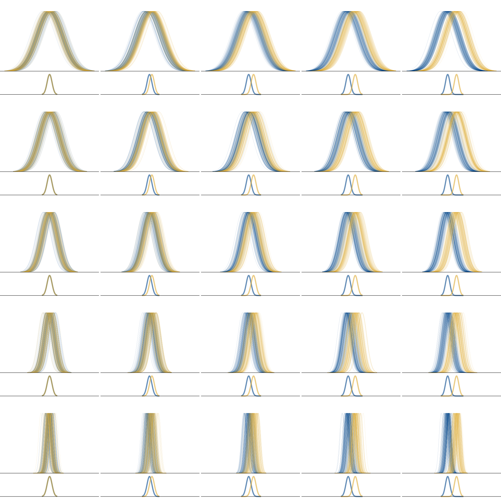{#fig-dist25 width=90%} 

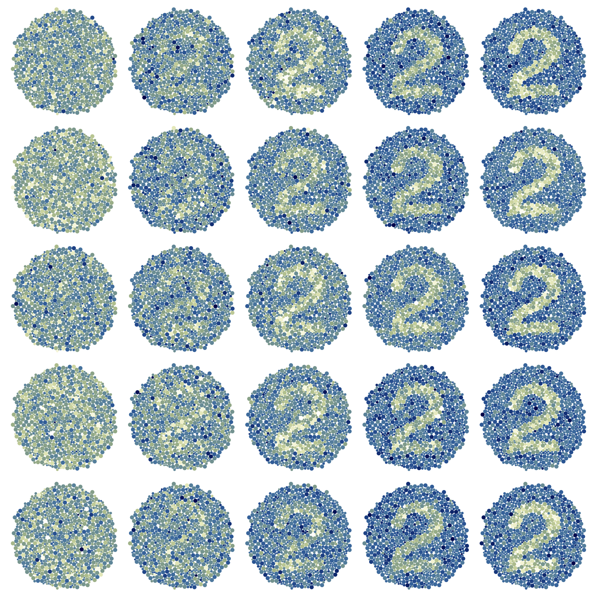{#fig-choro25 width=90%} 

{#fig-vsup25 width=90%} 

{#fig-vsup25 width=90%}  

{#fig-pix25 width=90%} 

{#fig-trans25 width=90%} 

An illustration of the 5x5x5 factorial design used in the experiment, along with the underlying distributional data that makes the plots. The theoretical distribution is a visualisation of 100 of the 1000 individual distributions that make up each dot in the colour blind test, where each individual distribution either belongs to the number (the yellow group) or the background (the blue group). The data is visualised for all levels of $D$ (0,1,2,3,4) on the x-axis, and $V$ (1,2,3,4,5) on the y-axis, across all five plot types (choropleth, bivariate, VSUP, pixel, transparency). We can see that the bottom right corner, when $D=5$ and $V=1$, is where all plots are the most visible. An effective uncertainty visualisation should become harder to read as *either* $D$ decreases or $V$ increases, and have a visible triangle stemming from the bottom right corner. 
:::

### Task and procedure
Participants were asked to specify their country of residence, age, pronouns, education level (based on the International Standard Classification of Education [@unesco-international]), and whether or not they had colour vision deficiency.
Participants were then instructed that they would be asked to identify numbers in a plot, and that, although the test may resemble a colour blind test, the test was not meant to measure colour vision deficiency.
They were asked to set their screen brightness to at least 75% and to turn off colour filters to ensure consistency in results [@gobira-assessing-2025].
Additionally, plot sizes were standardised.
When viewing the plots, participants were able to select a digit ranging from 0 to 9, or indicate that no number was visible within the plot using the interface shown in @fig-screenshot.
They also had the option to revisit the previous plot, allowing them to correct mistaken selections.
After every 25 plots, they were shown a plot with a clearly visible number as an attention check.
At the end of the study, participants were able to leave comments.
The study was estimated to take approximately 10 to 15 minutes to complete, and responses were collected via Prolific, an online survey website.

::: {#fig-screenshot fig-env="figure*"}

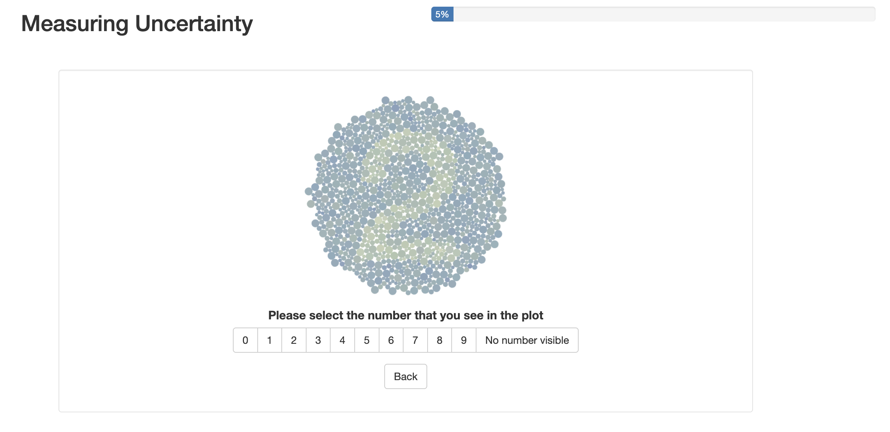{width=100%} 

A screenshot of the app as it appeared to participants while answering the stimulus question.
:::

<!-- use fig-env="figure*" to make figure two columns -->

::: {#fig-plotexample layout-ncol=10}

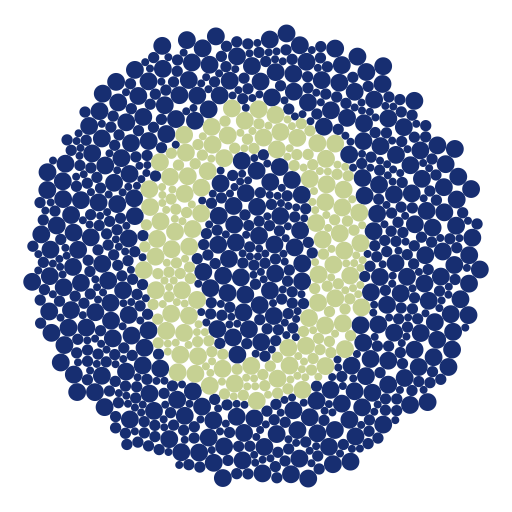{#fig-chor width=85%}

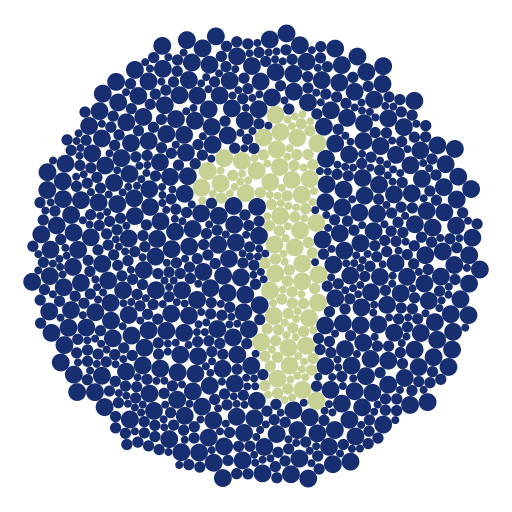{#fig-chor width=85%}

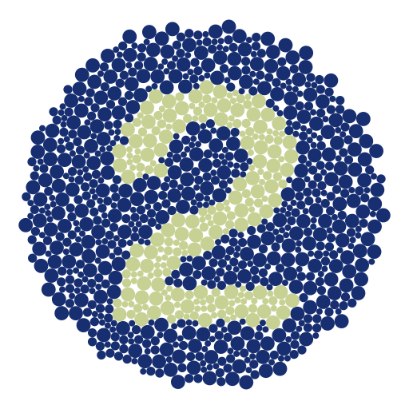{#fig-chor width=85%}

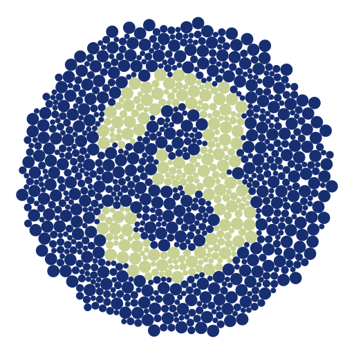{#fig-chor width=85%}

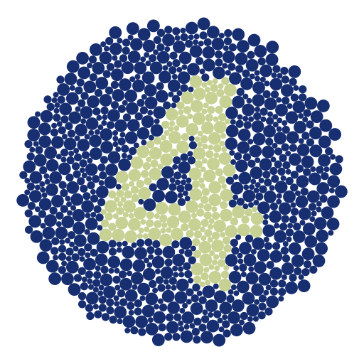{#fig-chor width=85%}

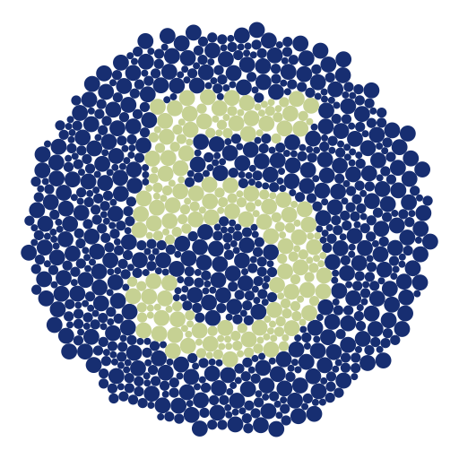{#fig-chor width=85%}

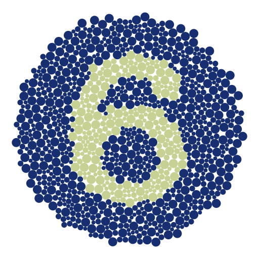{#fig-chor width=85%}

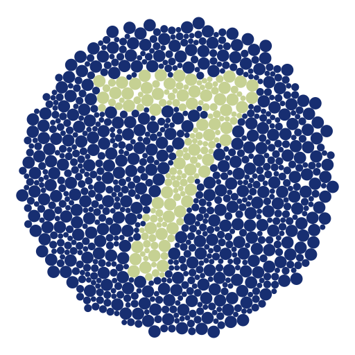{#fig-chor width=85%}

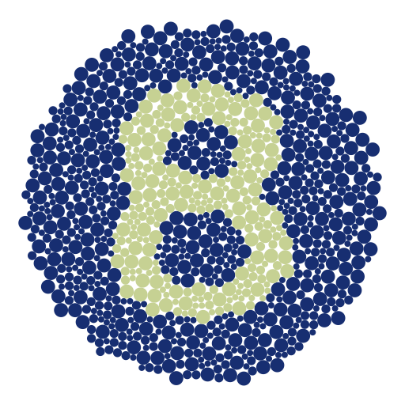{#fig-chor width=85%}

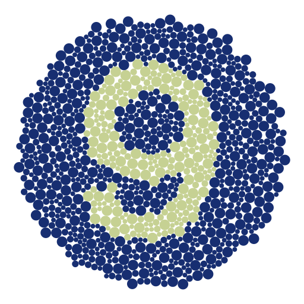{#fig-chor width=85%}

The ten attention checks used in the experiment, included here to illustrate the appearance of all 10 number plates, as well as the clarity of the attention checks.

:::

General demographic information is meant to provide an overview of our study sample, while information regarding colour vision deficiency, when combined with the results, allows us to evaluate unintentional issues in colour selection and plot design.
The number of correct selections will be compared across plot types and at the selected treatment distances ($D$) and standard deviations ($V$).
Ultimately, these values will be compared to generated significance tests in order to compare user output to accepted measures of difference between groups.

### Statistical methods
#### Deciding on a ground truth
The extensive literature on the lineup means that there is a wealth of information we can utilise to design our uncertainty visualisation experiment.
Designing an experiment where we have an equivalent classical test that can be easily calculated is actually the worst-case scenario for the lineup [@Majumder2013], and by extension, uncertainty visualisation.
When we compare our uncertainty visualisations to classical statistical tests, the idea is that, if the visualisations behave well when we *do* know the equivalent hypothesis test, they should also behave well when we don't [@Majumder2013].
Or even better, they will work when we don't even know what we want to test, which is the case for exploratory data analysis.

The correct null hypothesis for any one uncertainty visualisation is not set in stone, and can depend on the rationale participants use to identify the numbers.
Strictly looking at the data-generating process, we can see that the data will fulfil the assumptions of a $t$-test, the classic test for a difference between two groups.
This would suggest a $t$-test is the appropriate ground truth for our experiment.
However, in the context of a map, participants might use clustering of lighter or darker spots to make a guess at a shape, even if the full shape cannot be identified.
In these cases, tests of spatial autocorrelation, such as Moran's I and Geary's C [@cliff-auto-1981], that measure clustering of similar data values in areal regions, would be the more appropriate choice.
One test is more appropriate given the data-generating context, but the other is more appropriate given the spatial context in which the participants read the plot. 
For the sake of completeness, we will evaluate participants' responses against both models.

Using accuracy to compare the plots and hypothesis tests might feel like a natural approach to comparison, but it would be naive as it would end up penalising visualisations that do exactly what we have designed them to do, hide statistically spurious signal.
This approach would always suggest our choropleth map to be the best approach, for the very reason we want to avoid using it in the first place.
We are not looking for across-the-board "accuracy", but rather, a visualisation that is accurate when a statistical test would be accurate, and inaccurate when a statistical test would be inaccurate.
Therefore, we opt to compare visualisations using power curves, which is the same approach taken by the lineup literature [@Majumder2013].
Power curves show the probability of a statistical test detecting an effect, given that the effect actually exists, across a range of effect sizes.
Power curves allow us to compare the efficiency of different tests, so, for a given significance level, $\alpha$, a higher power curve (a higher probability of correctly rejecting a false hypothesis) makes a better test.
Ultimately, our goal is for our test to minimise error (type I or type II), and power curves allow us to compare hypothesis tests on this metric.
Often, hypothesis tests will cross, so there is no "uniformly most powerful" test. An additional rule of thumb for comparison is "the steeper the curve, the better", as that indicates the test has high sensitivity.
Usually, this power curve analysis is performed using effect size, but effect size can be difficult to calculate for many statistical tests, and some tests, such as Moran's I, have no effect size equivalent at all.
Therefore, we used $D$ and $V$ as proxies for effect size; however, comparing signal suppression methods using effect size might create smoother results, and is a potential future area of research.

#### Experimental power curve
Participant ability to select the correct number in the plot was modelled using a generalised linear mixed model with a binomial response.
Participant correctness is treated as the response variable, and $D$, $V$, and plot type are treated as explanatory variables, with up to the three-way interaction between these variables included in the model.
$D$ and $V$ are both continuous, while the plot type is discrete.
It is standard practice to account for individual ability to read plots using a random block effect [@Majumder2013], so our model also includes participants as a random effect.
The number in the plate is likely to have a similar impact, so that is also included as a random effect.

#### Theoretical power curves
Hypothesis tests are usually specified in terms of a test statistic, which is a function of a sample [@Casella2024].
This is a bit of a problem, because uncertainty visualisations, by their very nature, are designed for situations where we *don't* have a set sample, and instead are working with distributions.
There are $t$-test equivalents, such as the pooled $t$-test, that allow us to compare two distributions, but this does not exist for our spatial tests, and certainly not with the Bayesian hierarchical model we have used to generate the data.
That is, these common spatial autocorrelation metrics fail to take uncertainty into account in their calculations by assuming the variance of the areal estimates is equal, which results in biased estimates of the spatial structure [@koo-autocorr-2019; @waldhor-autocorr-1996; @jung-autocorr-2019].
For example, @koo-autocorr-2019 showed that measures of spatial autocorrelation are more extreme when uncertainty is not included.
@jung-autocorr-2019 warns that spatial autocorrelation measures are problematic without considering uncertainty information, especially in neighbourhood-based studies of public health data, which they displayed using data from the American Community Survey.
Few alternatives have been suggested to incorporate uncertainty within spatial autocorrelation metrics.
@waldhor-autocorr-1996 suggests a method to incorporate population size with Moran's I through changes to the covariance matrix, as it is common for population size to vary within areal units, which leads to different variances.
Another alternative proposed by @koo-autocorr-2019 is the Spatial Chattacharyya Coefficient, which incorporates the distribution underneath the estimates.
However, integrating uncertainty using these theoretical approaches will often only work for one test or the other and cannot be implemented with both the $t$-test and Moran's I test simultaneously.

Given that our data-generating process was known, we were able to use it to perform a Monte Carlo simulation, where we generated 100 samples of each of the 250 data sets used in the experiment.
For each simulated data set, Moran's I and its corresponding $p$-value were calculated for the alternative hypothesis of positive spatial autocorrelation (or spatial clustering).
A permutation test was used for the Moran's I calculation to establish the null distribution of the I statistic, and neighbouring regions were defined as only needing one shared boundary, as the areal regions are circles.
The $t$-test and its corresponding $p$-value were also calculated, with the alternative hypothesis being a difference between the two means.
These $p$-values are then used to calculate the theoretical power curves.

Estimating power curves for the theoretical hypothesis tests is not straightforward, so we will adapt the methods used by @Patrick2023.
When comparing hypothesis tests, it is standard to restrict the comparison to tests that have the same Type I error probability [@Casella2024].
Using the null plots, that is, when $D=0$, we can estimate the probability of rejecting $H_0$ when $H_0$ is true, which we denote as $\hat\alpha_k$, for each plot type, $k$.
Using this $\hat\alpha_k$ value, we can set the $\alpha$ for our theoretical tests, turning our $p$-values into accept/reject outcomes. 
These data points are comparable to the accept/reject outcomes we were able to observe in the participants' responses.
We then use these data points to model the theoretical power of the test using a generalised linear mixed model of the response variable, where $D$ and $V$ are treated as explanatory variables, with a two-way interaction.
The correct number is also included as a random effect.

## Results

### Participant Information

::: {.cell}

:::

137 individuals completed the study and passed the attention check.
The median study duration was 8.18 minutes with an interquartile range of 4.72 minutes.
Because individuals were provided a 'back' button in the case of accidental submissions, only the last observation entered by an individual for each plot is considered.
A Pearson's chi-squared test for independence indicates a non-significant relationship between plot type and number present in the data, indicating that random assignment of numbers was successful ($p$-value of 0.92).

::: {.cell}

:::

Demographically, participants tended to be younger, use he/him pronouns, and have a tertiary education.
37.96% of individuals identified as being between 18 and 25, while 38.69% identified as 26 to 35; the remaining individuals identified as older than 35.
64.96% of individuals use he/him pronouns, 32.85% use she/her, and the remaining individuals use they/them, or prefer not to answer.
86.86% of individuals indicated that their highest education level was tertiary, while the remaining individuals identified their education level as below tertiary or post-secondary non-tertiary education.
A large number of participants were from Africa and Europe (41.61% and 30.66%, respectively), and 5.11% of participants indicated that they were colour blind or unsure.

### Results Overview

::: {.cell}
::: {.cell-output-display}
![The full set of participant responses, coloured by whether or not they were able to identify the correct number in the plot, grouped according to the distance ($D$) between the distributions, and the standard deviation ($V$) in each individual estimate. The theoretical simulation from the $t$-test and Moran's I calculations is also included as a point of reference. We can see that the choropleth and bivariate map have an I-shape, the VSUP map makes an L-shape, and the pixel and transparency maps make an upper triangular shape. The I-shape indicates the variance has no impact on the visibility, the L-shape indicates the variance only has an impact on visibility at its maximum, and the upper triangular shape shows a consistent impact on visibility from the variance. None of the plot types perfectly match the pattern in the theoretical visualisation.](04-chap4_files/figure-pdf/fig-tileplot-1.pdf){#fig-tileplot width=100%}
:::
:::

@fig-tileplot shows the percent of participants who were able to make a correct selection for each type of plot, based on the distance ($D$) between the number and non-number groups, and the standard deviation ($V$) of the subsamples.
The grid for the choropleth and bivariate maps appears to be quite similar, with no visible effect from the change in $V$, only the change in $D$.
Looking at the VSUP map, we do get some interference, as expected, but the interference appears to be limited to the cases when the $D=1$ or $V=5$.
Outside of those two scenarios for the VSUP map, there does not appear to be a clear relationship with $V$.
The pixel and transparency map appear to have the lower triangles of visibility.
However, the theoretical hypothesis data does not appear to have the same sensitivity as the transparency or pixel map. 

### Power analysis
#### Estimating significance levels
To set the $\alpha$ for the theoretical test, we need to calculate the $\hat\alpha$ value for each plot type, $k$, where $k \in \{choropleth, bivariate, vsup, pixel, transparency \}$. 
While the lineup protocol has a theoretical calculation that can be used to estimate $\alpha$ due to the fact that any plot being picked by chance is $\frac 1 M$ for a lineup with $M$ plots (assuming there is no dependence structure between the plots) [@Majumder2013; @Vanderplas2021], this calculation does not translate to uncertainty visualisation.
As graphics do not come with a significance threshold [@Vanderplas2021], and a significance threshold is required to compare our plots to classic hypothesis tests, we estimate $\hat{\alpha}_k$ using the proportion of participants who identified a number in a plot that was just random noise.

@fig-h0calc shows the bootstrapped distribution for the significance level of each plot, $\hat{\alpha}_k$.
We can see that there is quite a large range in the distribution, which is likely caused by individual differences in risk aversion.
Reading the comments in the study, we found that some participants thought they were always supposed to see a number, and would make a guess if they had the slightest inkling towards a specific number, while other participants would only make a guess if they could fully make out the number's shape.
These tactics align with Moran's I test and $t$-test, respectively.
It may be more appropriate to also treat our value of $\hat{\alpha}_k$ as a random effects model, but this will theoretically and computationally overcomplicate the model.
Therefore, we will use the average number of false positives within each plot type to estimate $\hat{\alpha}_k$.

::: {.cell}
::: {.cell-output-display}
{#fig-h0calc width=70%}
:::
:::

#### Random effects model

::: {.cell}

:::

::: {.cell}
::: {.cell-output-display}
![A visualisation of the experimental power curves, estimated using a generalised linear random effects model (top) and generalised linear fixed effects model (bottom) for all 125 experimental factors: V (standard deviation), D (Distance), and K (plot type). The results of the theoretical hypothesis tests, the t-test, and Moran's I test, are shown using two different black dashed lines. We can see that the variance has little impact on the signal visibility in the choropleth and bivariate map, the visibility of the signal in the VSUP map shrinks to zero when V=5, regardless of the effect size, and the pixel and transparency map broadly follow the shape of the theoretical tests.](04-chap4_files/figure-pdf/fig-mixmodel-1.pdf){#fig-mixmodel width=70%}
:::
:::

@fig-mixmodel shows the random effects model and fixed effects components for each plot type, $D$ and $V$, with a black dashed line indicating the theoretical power curve of our hypothesis tests.
The two different dashed lines show the difference between the simulated $t$-test and Moran's I, and are slightly different shapes as the power curve is set based on that plot type's significance level, $\hat{\alpha}_k$.
The random effects model allows us to see the variation in individual participants, while the fixed effects average allows us to easily compare the different plot types.
In the random effects plot, the variability in the black dashed lines comes from the random effect of the numbers shown in the plate, while the variability in the experimental results comes from both the random effects of the numbers in the plate and the participants' ability to read the plot.
As the variance increases, we would expect the signal in the plate to become harder to see, as its statistical significance drops off.
Ideally, this drop off would occur at a rate that is similar to the hypothesis tests, represented by the black dashed lines.
If the coloured line for a plot sits above the hypothesis test, then the plot is showing a pattern that the classical hypothesis tests would consider to be insignificant.
While this can be a desirable property when comparing standard hypothesis tests, this is not necessarily a desirable property for uncertainty visualisation.
It is important to remember that the key issue with choropleth maps, and the reason we need uncertainty visualisation at all, is that they *always* show statistical signal, even if that signal is spurious.
We have designed this experiment such that the visibility *does* link to a signal, but that will not always be the case. 
Therefore, the power curve of the most appropriate plot will not necessarily sit above the black dashed lines, but rather, should have a shape that is similar to the hypothesis test curves across the different values of $D$. 

These charts seem to largely agree with our initial findings.
The choropleth and bivariate maps are constant, and the visibility of the plot appears to be largely independent of $V$, only changing with an increase in the average effect.
The VSUP appears to follow the theoretical line for $D=1,2$, but diverges for $D=3,4$ as the statistically significant difference at $V=5$ is hidden by the monochrome plate.
This divergence suggests that the alignment when $D=1,2$ is a coincidence born from the fact that when $D=1,2$, the power of the hypothesis test should be zero, and $V=5$ will also produce a power of zero, independent of the effect size in the plot.
Finally, we see that the pixel and transparency maps appear to do a reasonably good job of following the power curve of the theoretical hypothesis test, but the power is falling short at both ends of the spectrum.
The signal is not visible enough when variance is low, but it is too visible when variance is high.
This indicates that the test is not quite sensitive enough to changing values of $V$.
This issue in the pixel and transparency maps becomes less prevalent as $D$ increases, and at higher values of $D$, the visualisation actually sits between the results of the $t$-test and Moran's I test.

A closer inspection of the random effects models reveals some patterns in the participants' ability to read the plot. 
There is quite a bit of variation among participants, especially when $D=1$.
As the $D$ increases, the variance in the participants' responses decreases, a pattern that is less pronounced in the pixel and transparency map.
This indicates that, as the plots become easier to read, either due to decreasing $V$ or increasing $D$, the variance among viewers will also decrease.
Some participants perform rather badly across the board, but we can see others manage to track the theoretical power curve rather well. 
This indicates that, unlike in traditional hypothesis tests, there is a degree of skill involved in identifying a signal in uncertainty visualisations.
The importance of this skill becomes more pronounced as the effect size gets smaller.
This indicates that training could potentially improve the power of plots as statistical tests.

#### Hypothesis tests
*Relating to H1: Changes to the standard deviation in the distributions will result in no meaningful difference in our ability to read the number in the choropleth and bivariate map.* 

::: {#tbl-v-trend .cell tbl-cap='Effect of Standard Deviation (V) by Plot Type, Averaged Over Distance (D)'}
::: {.cell-output-display}

\begin{tabular}{l|r|r|r|r}
\hline
Plot Type & V Effect & SE & Z Ratio & P-Value\\
\hline
Choropleth & 0.179 & 0.144 & 1.238 & 0.216\\
\hline
Bivariate & -0.044 & 0.121 & -0.362 & 0.718\\
\hline
VSUP & -2.486 & 0.106 & -23.359 & 0.000\\
\hline
Pixel & -0.700 & 0.058 & -12.015 & 0.000\\
\hline
Transparency & -0.604 & 0.068 & -8.843 & 0.000\\
\hline
\end{tabular}

:::
:::

@tbl-v-trend shows the estimated marginal effect of $V$ for each plot type, averaging over the effect of $D$.
If the marginal effect is significantly different from zero, then $V$ has some effect on the visibility in the signal in the plot, but if it isn't significantly different from zero, then the variance does not have any impact on signal visibility at all.
We can see that the effect associated with $V$ for each plot type is insignificant in the case of the bivariate map and choropleth map, but significant for all other map types.
These conclusions remain true if we perform significance tests at set $D=1, 2, 3, 4$, instead of looking at the average across $D$.
These distance-based results are available in @sec-appendix-a.
This indicates that $V$ has no significant effect on the visibility of the signal in the bivariate and choropleth maps, given the generalised linear mixed effects model.

*Relating to H1 and H3: The probability of correctly reading the transparency and pixel map, as well as the probability of correctly reading the choropleth and bivariate map, will be similar.*

::: {#tbl-basicmodel .cell tbl-cap='Selected Comparison of Plot Types for Standard Deviation ($V$), Averaged Over Distance'}
::: {.cell-output-display}

\begin{tabular}{l|r|r|r|r}
\hline
Contrast & Estimate & SE & Z Ratio & P-Value\\
\hline
Choropleth - Bivariate & 0.223 & 0.188 & 1.181 & 0.475\\
\hline
Transparency - Pixel & 0.096 & 0.090 & 1.075 & 0.565\\
\hline
\end{tabular}

:::
:::

Comparisons of the standard deviation effect between plot types of interest are shown in @tbl-basicmodel.
The $p$-values were adjusted for multiple comparisons using the Sidak adjustment.
If the statistical information conveyed by two plots is equivalent, the signal visibility between the two plots will be equivalent. If this is true, the probability of correctly reading the transparency and pixel maps will be similar.
For the pairwise comparisons of the transparency/pixel map and the choropleth/bivariate map, significance tests at $D=1, 2, 3, 4$ result in the same conclusions in terms of significance. 
Distance-based results as well as all pairwise comparisons are available in the @sec-appendix-a.
The non-significant difference between the transparency and pixel map, as well as between the choropleth and bivariate map, indicates that standard deviation effects are similar between the plot types, as expected.

## Discussion
All hypotheses posed at the beginning of the experiment were either fully or partially confirmed, creating a foundation for a theory of signal suppression in uncertainty visualisation.

Unsurprisingly, the choropleth map had an insignificant relationship with standard deviation, as the standard deviation of each distribution was not included at all in the choropleth map. 
What *is* of note is that the bivariate map *also* had a coefficient of zero, and its coefficients on the mixed effects model were not significantly different from the choropleth map.
This finding is of particular note, as bivariate maps are frequently suggested as an alternative to choropleth maps, specifically for the purposes of suppressing statistically invalid signals.
However, these results indicate that, if your goal is to make statistically invalid signals invisible, *a bivariate map is functionally identical to a choropleth map*.
Any benefit in using a bivariate map will need to come from explicit calculation, and a visualisation that requires a mental calculation to be understood defeats the purpose of making a visualisation in the first place.

The results partially supported our second hypothesis.
The VSUP map, unlike the bivariate map, did achieve visual interference and was not functionally identical to the choropleth map; however, this interference did not align with the theoretical hypothesis tests.
The fact that every plate at $V=5$ was completely monochrome disproportionately pulled down the slope of the random effects model.
This caused better alignment with the theoretical tests for $D=2$, but incredibly poor alignment when $D=4$ and $D=5$.
The VSUP and bivariate maps were designed with the implicit knowledge of the maximum and minimum values of the data-generating process, which was only possible due to the artificial scenario of the experiment.
This requirement of knowledge could be considered a form of data snooping that disproportionately benefits the evaluation of the VSUP and bivariate maps, but the maps are impossible to calculate without it, and it serves as one of the main limitations to the approach.
Usually, the scaling of our axis or colours is done automatically, but locally scaled bivariate and VSUP maps, with no attention to the relationship between standard deviation and estimate value, are completely meaningless.
One could argue that a workaround for this issue is leveraging the monotonic shrinkage algorithms for VSUP palettes suggested by @Kay2019.
However, as @ggplot2 pointed out, the distinction between a coordinate transformation and a statistical transformation is not always so clear-cut.
Therefore, adjusting the coordinate to get a specific statistical output is indistinguishable from adjusting the statistic itself.
Not only would this violate one of our original limitations for plot selection, but it would also significantly increase the number of plots we would need to evaluate.
Therefore, we opted to test the classic VSUP map and did not extend to the methods suggested by @Kay2019.
The VSUP approach also has several other implicit limitations that we did not cover in this experiment.
For example, it cannot handle discontinuous distributions that oscillate between two distant outcomes, rather than maintaining a smooth transition between values.
The VSUP approach also only works for ordered variables, and does not make intuitive sense if we are uncertain about a categorical fill.
These limitations are absent in the pixel and transparency map.

Finally, the results for the pixel and transparency maps have some interesting implications for the statistical properties of plots.
Given that the two plots were aligned, we can isolate the benefit in the approach to the display of a full distribution, rather than the representation of a distribution as multiple values.
This means we can still effectively perform signal suppression in a situation where the pixel map is inappropriate.
These plots showed that we *can* achieve a signal that aligns with hypothesis testing (or at least a signal that has a consistently similar shape). 
There are likely several design changes that could improve this alignment, such as an optimised colour palette or sample size. 

Our results also have implications for the broader concepts of design in uncertainty visualisations.
The confirmation of **H1** indicates that treating uncertainty as a second variable, independent of the estimate, will not facilitate the suppression of false signals.
Plotting the estimate and uncertainty to separate aesthetic channels will prevent the uncertainty from visually interfering with the estimate, which means it has no mechanism to make more uncertain estimates harder to see, and will not prevent the visualisation from displaying spurious signals.
The confirmation of **H2** indicates that the correct representation of an estimate should be one that completely describes the distribution.
These findings provide empirical evidence for the formalisation suggested by @Kay2023.
The confirmation of **H3** suggests that, if we visualise our distribution as a sample, and ensure all the draws are equally weighted, they will provide an identically valid statistical signal.
This is particularly useful for the `ggdibbler` [@ggdibbler] R package, which leverages this perpendicularity in the grammar of graphics to make a range of flexible uncertainty visualisations for EDA.
If this hypothesis had proven to be false, these position adjustments would not be independent of the statistical information, and changing the position adjustment would change the signal suppression in the plot, making the suggested methods ineffective.
In the case where multiple random variables are being fed into the system at once, transparency is the only viable position adjustment to allow for even weighting of all sample outcomes.
Our results show that the system maintains statistical validity, even when we are unable to translate the results back to a numerical scale using the legend.

## Contributions, limitations, and future research
Several contributions were made in this paper.
We designed a visualisation experiment that is able to measure uncertainty as a latent variable, capturing its effect as noise, rather than signal. 
We also translated the statistical approaches from the lineup protocol to uncertainty visualisation, allowing us to compare pattern visibility to the outcomes of a $t$-test and Moran's I test.
By constructing the plots with respect to the grammar of graphics, we were able to understand *why* some approaches may, or may not, work and contribute towards a general theory of uncertainty visualisation, rather than limit ourselves to sweeping statements about plot types.

While these contributions are quite substantial, the work is not without its limitations.
The first limitation is that we were strict in our data-generating process. 
We decided to keep the data generation very simple, to avoid confounding data issues with other untested aspects of the design, but this did result in quite strict assumptions.
Our distribution shapes were limited to normal distributions, every observation had an identical standard deviation with no interfering pattern, and the only variance between observations came from the estimate's central values. 
While this data-generating process is limited, deviations from this strict scenario are more likely to help, rather than hinder, the uncertainty visualisation in comparison to the theoretical hypothesis tests.
There is ample evidence that classical hypothesis tests will outperform visual inference when the assumptions of the test are true, but the visual tests will do better when the assumptions are false [@Majumder2013; @Patrick2023; @Hofmann2012].
This indicates that more unusual data-generating processes that are more likely to violate traditional test assumptions may improve the performance of the visualisations.

There were quite a few factors in the plot design that likely impact the readability of the figures, but were outside the scope of this experiment.
Colour palette choice can affect how patterns are perceived in statistical graphics [@reda-rainbows-2021].
Anecdotally, when designing the experiment, we found that some palettes had a significant difference in visibility relative to others.
A different choice in colour palette may produce different results, although we hypothesise that the standard deviation effects would remain similar.
Therefore, values resulting from visibility calculations should not be treated as definitive values for the data used to generate the plots.

There were also several extensions to this work that might improve the sensitivity issues in the pixel and transparency maps. 
One is the effect of sample size in the visualisations.
We set the number of samples within each plot to be 50, which reduces the variance within the visualisation, but also compresses the colour scale, making individual colours harder to discern.
There may be a sample size trade-off in designing these visualisations that is having an effect on their sensitivity.
Theoretically, the pixel map approach could be generalised to any visualisation that can be made in `ggplot2` [@ggdibbler], so the signal suppression approach could be investigated for other aesthetics in other types of plots.
Additionally, we could extend our question to the cases where we have multiple uncertain variables at once, rather than only allowing variability in colour.
The size of the plot also seemed to have an effect on the visibility of the pattern, with smaller plots making the pattern easier to see.

Given the fact that the transparency map was effective, it would become a viable visualisation approach if an interpretable legend could be presented alongside the map. 
In its current state, as can be seen in @fig-maps, the colours do not exactly map to the legend, and as the standard error increases, that issue only gets worse as sample outcomes jump wildly around the colour scale and mix the colours shown in the plot.

There are also several potential extensions or issues we encountered when implementing the colour blind test that should be of note to anyone who wants to implement a similar method. 
We noticed an afterimage occasionally when doing the test, so including an image as a mask between plots may help alleviate this issue.
We did not conduct testing of font types, so the tendency for participants to get confused between numbers (specifically 6, 3 and 8) might be mitigated with a better font choice.
There are also colour blind tests that ask participants to trace a shape, rather than identify a number, which are less susceptible to memorisation.
Using software that allows participants to draw on data visualisations, such as the `r2d3` [@Robinson2023] R package, would allow researchers to implement that variant of the noise blind tests.
Alternatively, including a variety of shapes in the test may reduce the probability of random guessing by the participants.

## Ethics declaration {-}

Ethics approval for the online survey was granted by Monash University Human Research Ethics Committee (Project ID 51214). All applicants provided informed consent prior to participating in this research.

## Acknowledgements
The first author of this paper is supported in part by a scholarship from the Australian Energy Market Operator.
This research was supported by the Commonwealth through an Australian Government Research Training Program Scholarship [DOI: https://doi.org/10.82133/C42F-K220]. 
We thank Susan VanderPlas, Sarah Goodwin, and Emily Robinson for their insightful comments and feedback, which substantially improved the work.
The R packages used for this work were: `tidyverse` [@tidyverse], `distributional` [@distributional], `ggdist` [@Kay2023], `ggdibbler` [@ggdibbler], `patchwork` [@patchwork], `khroma` [@khroma], `colourspace` [@colorspace], `ozmaps` [@ozmaps], `sf` [@sfpack], `ggthemes` [@ggthemes], `MASS` [@MASS], `shadowtext` [@shadowtext], `flextable` [@flextable], `emmeans` [@emmeans], `kableExtra` [@kableExtra], `broom` [@broom], `lme4` [@lme4], `car` [@car], `janitor` [@janitor], `packcircles` [@packcircles], `gglogo` [@gglogo], `scales` [@scales], `glue` [@glue], `digest` [@digest], `ggbeeswarm` [@ggbeeswarm], `conflicted` [@conflicted], `sp` [@sp], and `spdep` [@sf].
The GitHub repository for this paper can be found at https://github.com/harriet-mason/uncertainty-experiment, which contains the files required to reproduce this article in full.

