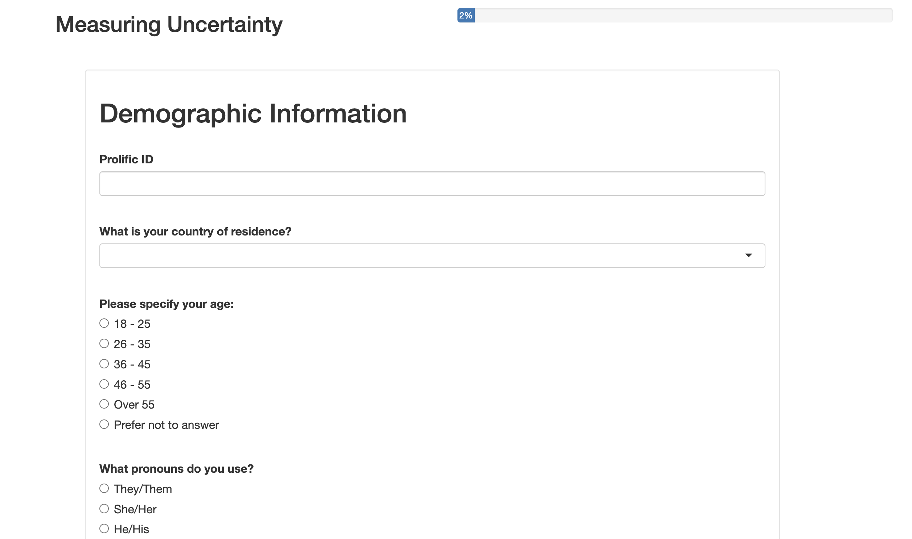
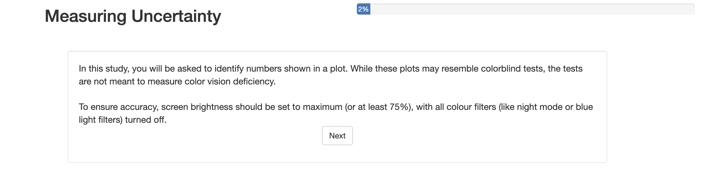
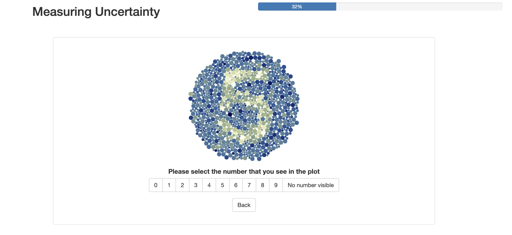
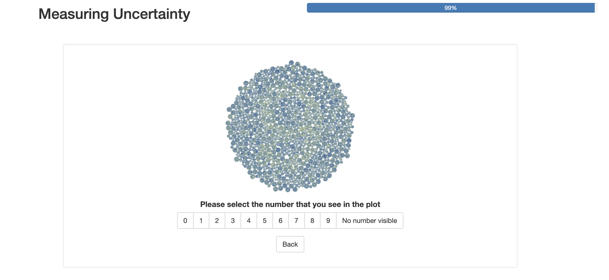
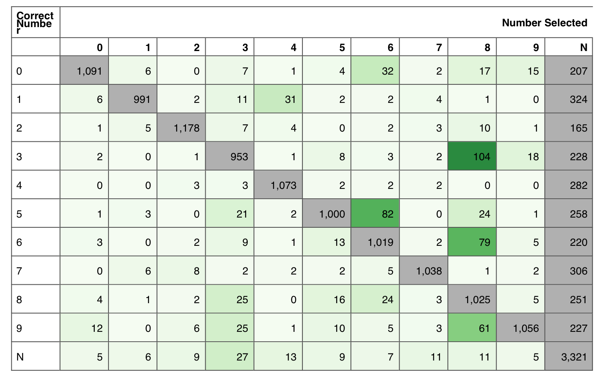
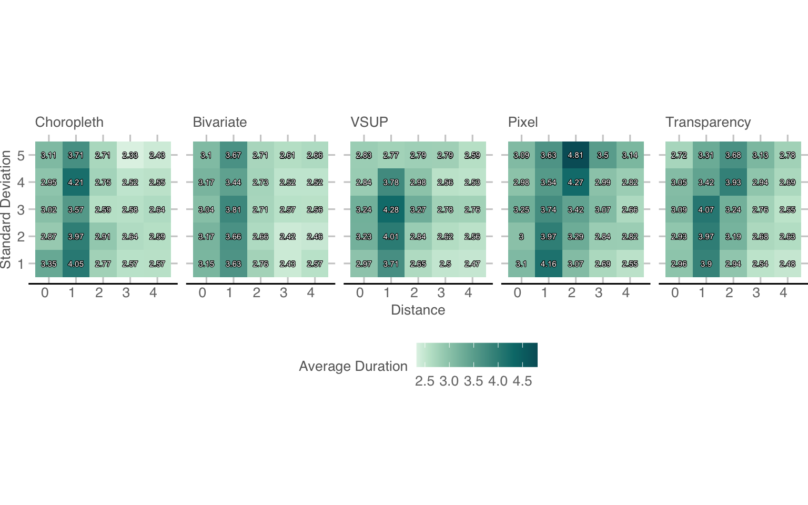
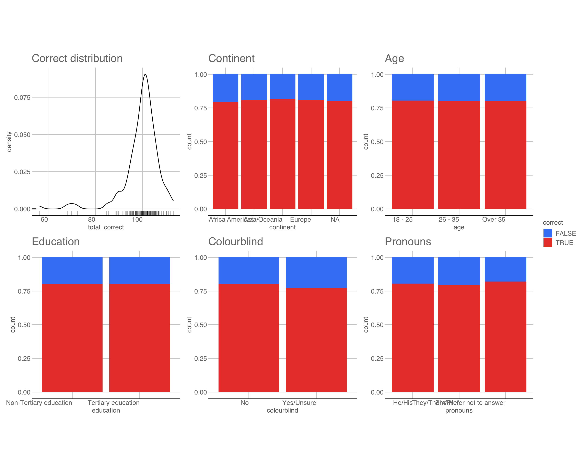
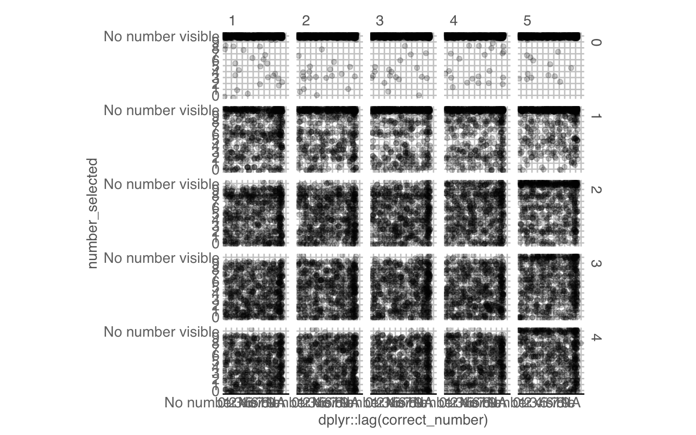

# Appendix A — Supplementary Material for “Colour Blinded by the Noise” {#sec-appa}


::: {.cell}

:::


## Full app screenshots
Screenshots from the app, in the order that the participants would experience them. 

{#fig-app1 width=90%} 

{#fig-app2 width=90%} 

{#fig-app3 width=90%} 

{#fig-app4 width=90%} 

{#fig-app5 width=90%} 

{#fig-app6 width=90%} 


## Confusion matrix of numbers
To understand the influence of the number displayed on the participant response, we can look at a confusion table of the number responses (@tbl-confusion-numbers).


::: {#tbl-confusion-numbers .cell tbl-cap='A confusion matrix of the number participants gave, alongside the true number in the plot. The off-diagonal elements are incorrect responses, with any concentration of numbers indicating values that are frequently mistaken for one another: 8 for 3, 6 and 9, and 6 for 5 are the most common.'}
::: {.cell-output-display}
{fig-pos='H' width=100%}
:::
:::


For the cases where there actually was a number visible, we can see that participants typically got the number right, or selected no number visible, rather than making an incorrect guess.
When there was no number, participants seemed to guess 3 more often than the other numbers.


::: {.cell tbl-pos='H' tbl-cap='A table showing the top four most commonly confused numbers.'}

:::


There are also a few numbers that participants seemed to get confused more often than others.
If we focus on the cases where 50 or more incorrect guesses were made, we can see that 3, 6 and 9 were frequently reported as an 8, and 5 was frequently reported as a 6.
This makes sense as we could consider the dots that make up 3, 6, and 9 to be a subset of those covered by 8, with a similar relationship existing between 5 and 6.
Interestingly, the converse is not true.
That is, 8 was not mistaken for a 3, 6, or 9, and 6 was not mistaken for 5.
This seems to suggest that, when participants could not make out the number with confidence, they seemed to have a tendency to add in structure that wasn't there, rather than miss structure that was there.


::: {#tbl-nonumber-mistakes .cell tbl-pos='H' tbl-cap='Numbers that were most commonly identified as \'no number visible\', ordered from most to least frequent. The order roughly coincides, inversely, with the number of \'dots\' that make up the number, suggesting that numbers constructed with fewer dots are harder to identify.'}
::: {.cell-output-display}
`````{=html}
<table class="table" style="font-size: 10px; width: auto !important; margin-left: auto; margin-right: auto;">
 <thead>
  <tr>
   <th style="text-align:left;"> Selected </th>
   <th style="text-align:right;"> Correct </th>
   <th style="text-align:right;"> Total </th>
   <th style="text-align:right;"> Dots </th>
  </tr>
 </thead>
<tbody>
  <tr grouplength="10"><td colspan="4" style="border-bottom: 1px solid;"><strong></strong></td></tr>
<tr>
   <td style="text-align:left;padding-left: 2em;" indentlevel="1"> No number visible </td>
   <td style="text-align:right;"> 1 </td>
   <td style="text-align:right;"> 324 </td>
   <td style="text-align:right;"> 121 </td>
  </tr>
  <tr>
   <td style="text-align:left;padding-left: 2em;" indentlevel="1"> No number visible </td>
   <td style="text-align:right;"> 7 </td>
   <td style="text-align:right;"> 306 </td>
   <td style="text-align:right;"> 155 </td>
  </tr>
  <tr>
   <td style="text-align:left;padding-left: 2em;" indentlevel="1"> No number visible </td>
   <td style="text-align:right;"> 4 </td>
   <td style="text-align:right;"> 282 </td>
   <td style="text-align:right;"> 189 </td>
  </tr>
  <tr>
   <td style="text-align:left;padding-left: 2em;" indentlevel="1"> No number visible </td>
   <td style="text-align:right;"> 5 </td>
   <td style="text-align:right;"> 258 </td>
   <td style="text-align:right;"> 229 </td>
  </tr>
  <tr>
   <td style="text-align:left;padding-left: 2em;" indentlevel="1"> No number visible </td>
   <td style="text-align:right;"> 8 </td>
   <td style="text-align:right;"> 251 </td>
   <td style="text-align:right;"> 241 </td>
  </tr>
  <tr>
   <td style="text-align:left;padding-left: 2em;" indentlevel="1"> No number visible </td>
   <td style="text-align:right;"> 3 </td>
   <td style="text-align:right;"> 228 </td>
   <td style="text-align:right;"> 212 </td>
  </tr>
  <tr>
   <td style="text-align:left;padding-left: 2em;" indentlevel="1"> No number visible </td>
   <td style="text-align:right;"> 9 </td>
   <td style="text-align:right;"> 227 </td>
   <td style="text-align:right;"> 255 </td>
  </tr>
  <tr>
   <td style="text-align:left;padding-left: 2em;" indentlevel="1"> No number visible </td>
   <td style="text-align:right;"> 6 </td>
   <td style="text-align:right;"> 220 </td>
   <td style="text-align:right;"> 221 </td>
  </tr>
  <tr>
   <td style="text-align:left;padding-left: 2em;" indentlevel="1"> No number visible </td>
   <td style="text-align:right;"> 0 </td>
   <td style="text-align:right;"> 207 </td>
   <td style="text-align:right;"> 218 </td>
  </tr>
  <tr>
   <td style="text-align:left;padding-left: 2em;" indentlevel="1"> No number visible </td>
   <td style="text-align:right;"> 2 </td>
   <td style="text-align:right;"> 165 </td>
   <td style="text-align:right;"> 218 </td>
  </tr>
</tbody>
</table>

`````
:::
:::


Additionally, the number 1 (and possibly 7) were more frequently reported as no number visible relative to the other numbers (@tbl-nonumber-mistakes).
This might be due to those numbers having less circles in the "number" group relative to the "background" group, as we can see the top 3 numbers reported as  "no number" also had the lowest number of "number" dots relative to those in the background.
However, this trend seems to drop off after 1, 7, and 4.


## Duration Analysis
The trend in the amount of time participants spent on each question seems to align with the probability of getting the question correct.
@fig-duration-heatmap shows the median amount of seconds spent on each $D$, $V$, and plot type.
Unsurprisingly, the most amount of time across all plots was on the $D=1$ case, when the signal was not particularly strong.
The pixel and transparency maps have a lower triangle of easy to see numbers, that become harder to extract as both $D$ decreases and $V$ increases.
It is also clear that participants rarely spent more than a few seconds on each plot.
This also highlights that, by making uncertainty something that should be visibly seen, a well designed uncertainty visualisation can be correctly within a few seconds.


::: {.cell}
::: {.cell-output-display}
{#fig-duration-heatmap fig-pos='H' width=100%}
:::
:::


::: {.cell}

:::


## Demographic Analysis
The demographic analysis indicates no relationship between the demographic details and the proportion of correct responses. 


::: {.cell}
::: {.cell-output-display}
{fig-pos='H' width=100%}
:::
:::


## Additional model comparison results
The distance-based results as well as all pairwise comparisons, as mentioned in the main text.


::: {#tbl-v-trend1 .cell tbl-pos='H' tbl-cap='Results for Standard Deviation Trend by Plot Type at Distance = 1'}
::: {.cell-output-display}
`````{=html}
<table>
 <thead>
  <tr>
   <th style="text-align:left;"> plot_type </th>
   <th style="text-align:right;"> V.trend </th>
   <th style="text-align:right;"> SE </th>
   <th style="text-align:right;"> z.ratio </th>
   <th style="text-align:right;"> p.value </th>
  </tr>
 </thead>
<tbody>
  <tr>
   <td style="text-align:left;"> Choropleth </td>
   <td style="text-align:right;"> -0.026 </td>
   <td style="text-align:right;"> 0.056 </td>
   <td style="text-align:right;"> -0.459 </td>
   <td style="text-align:right;"> 0.646 </td>
  </tr>
  <tr>
   <td style="text-align:left;"> Bivariate </td>
   <td style="text-align:right;"> -0.037 </td>
   <td style="text-align:right;"> 0.055 </td>
   <td style="text-align:right;"> -0.675 </td>
   <td style="text-align:right;"> 0.500 </td>
  </tr>
  <tr>
   <td style="text-align:left;"> VSUP </td>
   <td style="text-align:right;"> -0.576 </td>
   <td style="text-align:right;"> 0.059 </td>
   <td style="text-align:right;"> -9.704 </td>
   <td style="text-align:right;"> 0.000 </td>
  </tr>
  <tr>
   <td style="text-align:left;"> Pixel </td>
   <td style="text-align:right;"> -0.516 </td>
   <td style="text-align:right;"> 0.063 </td>
   <td style="text-align:right;"> -8.252 </td>
   <td style="text-align:right;"> 0.000 </td>
  </tr>
  <tr>
   <td style="text-align:left;"> Transparency </td>
   <td style="text-align:right;"> -0.540 </td>
   <td style="text-align:right;"> 0.066 </td>
   <td style="text-align:right;"> -8.231 </td>
   <td style="text-align:right;"> 0.000 </td>
  </tr>
</tbody>
</table>

`````
:::
:::


::: {#tbl-v-trend2 .cell tbl-pos='H' tbl-cap='Results for Standard Deviation Trend by Plot Type at Distance = 2'}
::: {.cell-output-display}

\begin{tabular}{l|r|r|r|r}
\hline
plot\_type & V.trend & SE & z.ratio & p.value\\
\hline
Choropleth & 0.110 & 0.098 & 1.127 & 0.260\\
\hline
Bivariate & -0.041 & 0.083 & -0.493 & 0.622\\
\hline
VSUP & -1.849 & 0.077 & -23.915 & 0.000\\
\hline
Pixel & -0.639 & 0.047 & -13.736 & 0.000\\
\hline
Transparency & -0.583 & 0.051 & -11.438 & 0.000\\
\hline
\end{tabular}


:::
:::


::: {#tbl-v-trend3 .cell tbl-pos='H' tbl-cap='Results for Standard Deviation Trend by Plot Type at Distance = 3'}
::: {.cell-output-display}
`````{=html}
<table>
 <thead>
  <tr>
   <th style="text-align:left;"> plot_type </th>
   <th style="text-align:right;"> V.trend </th>
   <th style="text-align:right;"> SE </th>
   <th style="text-align:right;"> z.ratio </th>
   <th style="text-align:right;"> p.value </th>
  </tr>
 </thead>
<tbody>
  <tr>
   <td style="text-align:left;"> Choropleth </td>
   <td style="text-align:right;"> 0.246 </td>
   <td style="text-align:right;"> 0.193 </td>
   <td style="text-align:right;"> 1.277 </td>
   <td style="text-align:right;"> 0.201 </td>
  </tr>
  <tr>
   <td style="text-align:left;"> Bivariate </td>
   <td style="text-align:right;"> -0.044 </td>
   <td style="text-align:right;"> 0.163 </td>
   <td style="text-align:right;"> -0.272 </td>
   <td style="text-align:right;"> 0.786 </td>
  </tr>
  <tr>
   <td style="text-align:left;"> VSUP </td>
   <td style="text-align:right;"> -3.122 </td>
   <td style="text-align:right;"> 0.139 </td>
   <td style="text-align:right;"> -22.406 </td>
   <td style="text-align:right;"> 0.000 </td>
  </tr>
  <tr>
   <td style="text-align:left;"> Pixel </td>
   <td style="text-align:right;"> -0.762 </td>
   <td style="text-align:right;"> 0.078 </td>
   <td style="text-align:right;"> -9.816 </td>
   <td style="text-align:right;"> 0.000 </td>
  </tr>
  <tr>
   <td style="text-align:left;"> Transparency </td>
   <td style="text-align:right;"> -0.626 </td>
   <td style="text-align:right;"> 0.093 </td>
   <td style="text-align:right;"> -6.714 </td>
   <td style="text-align:right;"> 0.000 </td>
  </tr>
</tbody>
</table>

`````
:::
:::


::: {#tbl-v-trend4 .cell tbl-pos='H' tbl-cap='Results for Standard Deviation Trend by Plot Type at Distance = 4'}
::: {.cell-output-display}
`````{=html}
<table>
 <thead>
  <tr>
   <th style="text-align:left;"> plot_type </th>
   <th style="text-align:right;"> V.trend </th>
   <th style="text-align:right;"> SE </th>
   <th style="text-align:right;"> z.ratio </th>
   <th style="text-align:right;"> p.value </th>
  </tr>
 </thead>
<tbody>
  <tr>
   <td style="text-align:left;"> Choropleth </td>
   <td style="text-align:right;"> 0.382 </td>
   <td style="text-align:right;"> 0.293 </td>
   <td style="text-align:right;"> 1.304 </td>
   <td style="text-align:right;"> 0.192 </td>
  </tr>
  <tr>
   <td style="text-align:left;"> Bivariate </td>
   <td style="text-align:right;"> -0.048 </td>
   <td style="text-align:right;"> 0.249 </td>
   <td style="text-align:right;"> -0.192 </td>
   <td style="text-align:right;"> 0.848 </td>
  </tr>
  <tr>
   <td style="text-align:left;"> VSUP </td>
   <td style="text-align:right;"> -4.395 </td>
   <td style="text-align:right;"> 0.209 </td>
   <td style="text-align:right;"> -20.991 </td>
   <td style="text-align:right;"> 0.000 </td>
  </tr>
  <tr>
   <td style="text-align:left;"> Pixel </td>
   <td style="text-align:right;"> -0.885 </td>
   <td style="text-align:right;"> 0.125 </td>
   <td style="text-align:right;"> -7.108 </td>
   <td style="text-align:right;"> 0.000 </td>
  </tr>
  <tr>
   <td style="text-align:left;"> Transparency </td>
   <td style="text-align:right;"> -0.669 </td>
   <td style="text-align:right;"> 0.150 </td>
   <td style="text-align:right;"> -4.453 </td>
   <td style="text-align:right;"> 0.000 </td>
  </tr>
</tbody>
</table>

`````
:::
:::


::: {#tbl-basicmodel1 .cell tbl-cap='Results for Standard Deviation Trend by Plot Type at Distance = 1'}
::: {.cell-output-display}
`````{=html}
<table>
 <thead>
  <tr>
   <th style="text-align:left;"> contrast </th>
   <th style="text-align:right;"> estimate </th>
   <th style="text-align:right;"> SE </th>
   <th style="text-align:right;"> z.ratio </th>
   <th style="text-align:right;"> p.value </th>
  </tr>
 </thead>
<tbody>
  <tr>
   <td style="text-align:left;"> Choropleth - Bivariate </td>
   <td style="text-align:right;"> 0.012 </td>
   <td style="text-align:right;"> 0.078 </td>
   <td style="text-align:right;"> 0.149 </td>
   <td style="text-align:right;"> 1.000 </td>
  </tr>
  <tr>
   <td style="text-align:left;"> Choropleth - VSUP </td>
   <td style="text-align:right;"> 0.551 </td>
   <td style="text-align:right;"> 0.081 </td>
   <td style="text-align:right;"> 6.759 </td>
   <td style="text-align:right;"> 0.000 </td>
  </tr>
  <tr>
   <td style="text-align:left;"> Choropleth - Pixel </td>
   <td style="text-align:right;"> 0.491 </td>
   <td style="text-align:right;"> 0.084 </td>
   <td style="text-align:right;"> 5.861 </td>
   <td style="text-align:right;"> 0.000 </td>
  </tr>
  <tr>
   <td style="text-align:left;"> Choropleth - Transparency </td>
   <td style="text-align:right;"> 0.514 </td>
   <td style="text-align:right;"> 0.086 </td>
   <td style="text-align:right;"> 5.978 </td>
   <td style="text-align:right;"> 0.000 </td>
  </tr>
  <tr>
   <td style="text-align:left;"> Bivariate - VSUP </td>
   <td style="text-align:right;"> 0.539 </td>
   <td style="text-align:right;"> 0.081 </td>
   <td style="text-align:right;"> 6.650 </td>
   <td style="text-align:right;"> 0.000 </td>
  </tr>
  <tr>
   <td style="text-align:left;"> Bivariate - Pixel </td>
   <td style="text-align:right;"> 0.479 </td>
   <td style="text-align:right;"> 0.083 </td>
   <td style="text-align:right;"> 5.745 </td>
   <td style="text-align:right;"> 0.000 </td>
  </tr>
  <tr>
   <td style="text-align:left;"> Bivariate - Transparency </td>
   <td style="text-align:right;"> 0.502 </td>
   <td style="text-align:right;"> 0.086 </td>
   <td style="text-align:right;"> 5.865 </td>
   <td style="text-align:right;"> 0.000 </td>
  </tr>
  <tr>
   <td style="text-align:left;"> VSUP - Pixel </td>
   <td style="text-align:right;"> -0.060 </td>
   <td style="text-align:right;"> 0.086 </td>
   <td style="text-align:right;"> -0.697 </td>
   <td style="text-align:right;"> 0.957 </td>
  </tr>
  <tr>
   <td style="text-align:left;"> VSUP - Transparency </td>
   <td style="text-align:right;"> -0.037 </td>
   <td style="text-align:right;"> 0.088 </td>
   <td style="text-align:right;"> -0.416 </td>
   <td style="text-align:right;"> 0.994 </td>
  </tr>
  <tr>
   <td style="text-align:left;"> Pixel - Transparency </td>
   <td style="text-align:right;"> 0.023 </td>
   <td style="text-align:right;"> 0.090 </td>
   <td style="text-align:right;"> 0.257 </td>
   <td style="text-align:right;"> 0.999 </td>
  </tr>
</tbody>
</table>

`````
:::
:::


::: {#tbl-basicmodel2 .cell tbl-cap='Results for Standard Deviation Trend by Plot Type at Distance = 2'}
::: {.cell-output-display}
`````{=html}
<table>
 <thead>
  <tr>
   <th style="text-align:left;"> contrast </th>
   <th style="text-align:right;"> estimate </th>
   <th style="text-align:right;"> SE </th>
   <th style="text-align:right;"> z.ratio </th>
   <th style="text-align:right;"> p.value </th>
  </tr>
 </thead>
<tbody>
  <tr>
   <td style="text-align:left;"> Choropleth - Bivariate </td>
   <td style="text-align:right;"> 0.151 </td>
   <td style="text-align:right;"> 0.128 </td>
   <td style="text-align:right;"> 1.179 </td>
   <td style="text-align:right;"> 0.764 </td>
  </tr>
  <tr>
   <td style="text-align:left;"> Choropleth - VSUP </td>
   <td style="text-align:right;"> 1.960 </td>
   <td style="text-align:right;"> 0.125 </td>
   <td style="text-align:right;"> 15.695 </td>
   <td style="text-align:right;"> 0.000 </td>
  </tr>
  <tr>
   <td style="text-align:left;"> Choropleth - Pixel </td>
   <td style="text-align:right;"> 0.750 </td>
   <td style="text-align:right;"> 0.108 </td>
   <td style="text-align:right;"> 6.915 </td>
   <td style="text-align:right;"> 0.000 </td>
  </tr>
  <tr>
   <td style="text-align:left;"> Choropleth - Transparency </td>
   <td style="text-align:right;"> 0.693 </td>
   <td style="text-align:right;"> 0.110 </td>
   <td style="text-align:right;"> 6.281 </td>
   <td style="text-align:right;"> 0.000 </td>
  </tr>
  <tr>
   <td style="text-align:left;"> Bivariate - VSUP </td>
   <td style="text-align:right;"> 1.809 </td>
   <td style="text-align:right;"> 0.113 </td>
   <td style="text-align:right;"> 15.986 </td>
   <td style="text-align:right;"> 0.000 </td>
  </tr>
  <tr>
   <td style="text-align:left;"> Bivariate - Pixel </td>
   <td style="text-align:right;"> 0.599 </td>
   <td style="text-align:right;"> 0.095 </td>
   <td style="text-align:right;"> 6.312 </td>
   <td style="text-align:right;"> 0.000 </td>
  </tr>
  <tr>
   <td style="text-align:left;"> Bivariate - Transparency </td>
   <td style="text-align:right;"> 0.542 </td>
   <td style="text-align:right;"> 0.097 </td>
   <td style="text-align:right;"> 5.584 </td>
   <td style="text-align:right;"> 0.000 </td>
  </tr>
  <tr>
   <td style="text-align:left;"> VSUP - Pixel </td>
   <td style="text-align:right;"> -1.210 </td>
   <td style="text-align:right;"> 0.090 </td>
   <td style="text-align:right;"> -13.504 </td>
   <td style="text-align:right;"> 0.000 </td>
  </tr>
  <tr>
   <td style="text-align:left;"> VSUP - Transparency </td>
   <td style="text-align:right;"> -1.267 </td>
   <td style="text-align:right;"> 0.092 </td>
   <td style="text-align:right;"> -13.755 </td>
   <td style="text-align:right;"> 0.000 </td>
  </tr>
  <tr>
   <td style="text-align:left;"> Pixel - Transparency </td>
   <td style="text-align:right;"> -0.056 </td>
   <td style="text-align:right;"> 0.069 </td>
   <td style="text-align:right;"> -0.821 </td>
   <td style="text-align:right;"> 0.924 </td>
  </tr>
</tbody>
</table>

`````
:::
:::


::: {#tbl-basicmodel3 .cell tbl-cap='Results for Standard Deviation Trend by Plot Type at Distance = 3'}
::: {.cell-output-display}
`````{=html}
<table>
 <thead>
  <tr>
   <th style="text-align:left;"> contrast </th>
   <th style="text-align:right;"> estimate </th>
   <th style="text-align:right;"> SE </th>
   <th style="text-align:right;"> z.ratio </th>
   <th style="text-align:right;"> p.value </th>
  </tr>
 </thead>
<tbody>
  <tr>
   <td style="text-align:left;"> Choropleth - Bivariate </td>
   <td style="text-align:right;"> 0.290 </td>
   <td style="text-align:right;"> 0.252 </td>
   <td style="text-align:right;"> 1.151 </td>
   <td style="text-align:right;"> 0.779 </td>
  </tr>
  <tr>
   <td style="text-align:left;"> Choropleth - VSUP </td>
   <td style="text-align:right;"> 3.368 </td>
   <td style="text-align:right;"> 0.238 </td>
   <td style="text-align:right;"> 14.153 </td>
   <td style="text-align:right;"> 0.000 </td>
  </tr>
  <tr>
   <td style="text-align:left;"> Choropleth - Pixel </td>
   <td style="text-align:right;"> 1.008 </td>
   <td style="text-align:right;"> 0.208 </td>
   <td style="text-align:right;"> 4.852 </td>
   <td style="text-align:right;"> 0.000 </td>
  </tr>
  <tr>
   <td style="text-align:left;"> Choropleth - Transparency </td>
   <td style="text-align:right;"> 0.872 </td>
   <td style="text-align:right;"> 0.214 </td>
   <td style="text-align:right;"> 4.074 </td>
   <td style="text-align:right;"> 0.000 </td>
  </tr>
  <tr>
   <td style="text-align:left;"> Bivariate - VSUP </td>
   <td style="text-align:right;"> 3.078 </td>
   <td style="text-align:right;"> 0.214 </td>
   <td style="text-align:right;"> 14.368 </td>
   <td style="text-align:right;"> 0.000 </td>
  </tr>
  <tr>
   <td style="text-align:left;"> Bivariate - Pixel </td>
   <td style="text-align:right;"> 0.718 </td>
   <td style="text-align:right;"> 0.180 </td>
   <td style="text-align:right;"> 3.982 </td>
   <td style="text-align:right;"> 0.001 </td>
  </tr>
  <tr>
   <td style="text-align:left;"> Bivariate - Transparency </td>
   <td style="text-align:right;"> 0.582 </td>
   <td style="text-align:right;"> 0.188 </td>
   <td style="text-align:right;"> 3.102 </td>
   <td style="text-align:right;"> 0.016 </td>
  </tr>
  <tr>
   <td style="text-align:left;"> VSUP - Pixel </td>
   <td style="text-align:right;"> -2.360 </td>
   <td style="text-align:right;"> 0.159 </td>
   <td style="text-align:right;"> -14.863 </td>
   <td style="text-align:right;"> 0.000 </td>
  </tr>
  <tr>
   <td style="text-align:left;"> VSUP - Transparency </td>
   <td style="text-align:right;"> -2.496 </td>
   <td style="text-align:right;"> 0.167 </td>
   <td style="text-align:right;"> -14.935 </td>
   <td style="text-align:right;"> 0.000 </td>
  </tr>
  <tr>
   <td style="text-align:left;"> Pixel - Transparency </td>
   <td style="text-align:right;"> -0.136 </td>
   <td style="text-align:right;"> 0.121 </td>
   <td style="text-align:right;"> -1.124 </td>
   <td style="text-align:right;"> 0.794 </td>
  </tr>
</tbody>
</table>

`````
:::
:::


::: {#tbl-basicmodel4 .cell tbl-cap='Results for Standard Deviation Trend by Plot Type at Distance = 4'}
::: {.cell-output-display}
`````{=html}
<table>
 <thead>
  <tr>
   <th style="text-align:left;"> contrast </th>
   <th style="text-align:right;"> estimate </th>
   <th style="text-align:right;"> SE </th>
   <th style="text-align:right;"> z.ratio </th>
   <th style="text-align:right;"> p.value </th>
  </tr>
 </thead>
<tbody>
  <tr>
   <td style="text-align:left;"> Choropleth - Bivariate </td>
   <td style="text-align:right;"> 0.430 </td>
   <td style="text-align:right;"> 0.385 </td>
   <td style="text-align:right;"> 1.118 </td>
   <td style="text-align:right;"> 0.797 </td>
  </tr>
  <tr>
   <td style="text-align:left;"> Choropleth - VSUP </td>
   <td style="text-align:right;"> 4.777 </td>
   <td style="text-align:right;"> 0.360 </td>
   <td style="text-align:right;"> 13.259 </td>
   <td style="text-align:right;"> 0.000 </td>
  </tr>
  <tr>
   <td style="text-align:left;"> Choropleth - Pixel </td>
   <td style="text-align:right;"> 1.267 </td>
   <td style="text-align:right;"> 0.318 </td>
   <td style="text-align:right;"> 3.981 </td>
   <td style="text-align:right;"> 0.001 </td>
  </tr>
  <tr>
   <td style="text-align:left;"> Choropleth - Transparency </td>
   <td style="text-align:right;"> 1.051 </td>
   <td style="text-align:right;"> 0.329 </td>
   <td style="text-align:right;"> 3.194 </td>
   <td style="text-align:right;"> 0.012 </td>
  </tr>
  <tr>
   <td style="text-align:left;"> Bivariate - VSUP </td>
   <td style="text-align:right;"> 4.348 </td>
   <td style="text-align:right;"> 0.325 </td>
   <td style="text-align:right;"> 13.362 </td>
   <td style="text-align:right;"> 0.000 </td>
  </tr>
  <tr>
   <td style="text-align:left;"> Bivariate - Pixel </td>
   <td style="text-align:right;"> 0.837 </td>
   <td style="text-align:right;"> 0.278 </td>
   <td style="text-align:right;"> 3.008 </td>
   <td style="text-align:right;"> 0.022 </td>
  </tr>
  <tr>
   <td style="text-align:left;"> Bivariate - Transparency </td>
   <td style="text-align:right;"> 0.622 </td>
   <td style="text-align:right;"> 0.291 </td>
   <td style="text-align:right;"> 2.137 </td>
   <td style="text-align:right;"> 0.205 </td>
  </tr>
  <tr>
   <td style="text-align:left;"> VSUP - Pixel </td>
   <td style="text-align:right;"> -3.510 </td>
   <td style="text-align:right;"> 0.243 </td>
   <td style="text-align:right;"> -14.455 </td>
   <td style="text-align:right;"> 0.000 </td>
  </tr>
  <tr>
   <td style="text-align:left;"> VSUP - Transparency </td>
   <td style="text-align:right;"> -3.726 </td>
   <td style="text-align:right;"> 0.257 </td>
   <td style="text-align:right;"> -14.485 </td>
   <td style="text-align:right;"> 0.000 </td>
  </tr>
  <tr>
   <td style="text-align:left;"> Pixel - Transparency </td>
   <td style="text-align:right;"> -0.216 </td>
   <td style="text-align:right;"> 0.195 </td>
   <td style="text-align:right;"> -1.107 </td>
   <td style="text-align:right;"> 0.803 </td>
  </tr>
</tbody>
</table>

`````
:::
:::


<!--
## Lag effects


::: {.cell}
::: {.cell-output-display}
{width=768}
:::
:::


## Also check for tiredness


::: {.cell}

:::

-->
